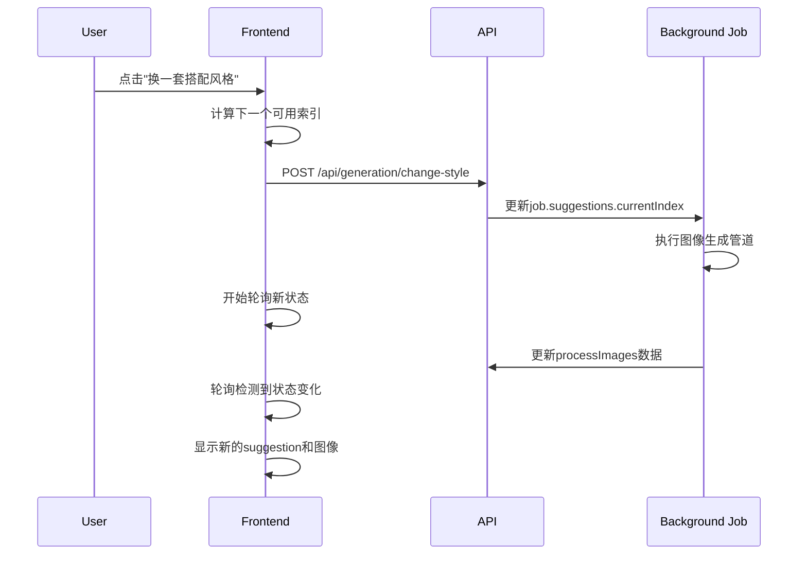

# 轮询逻辑与并发状态追踪机制分析

**文档类型**: 技术架构分析
**更新时间**: 2025-01-02
**涉及文件**: `app/chat/page.tsx`, `lib/ai.ts`
**问题范围**: 前端状态轮询、并发任务处理、状态同步

---

## 1. 系统概览

StyleAI-RP 使用基于轮询的状态管理机制来处理长时间运行的AI图像生成任务。系统支持多suggestion并发生成，但在状态追踪和图像归属方面存在设计缺陷。

### 1.1 核心架构

```
Frontend (React) ←→ API Routes ←→ Background Jobs ←→ External AI Services
     ↓                ↓              ↓                    ↓
   轮询状态          任务管理        管道执行            图像生成
```

## 2. 轮询机制详细分析

### 2.1 轮询启动与配置

```typescript
// 轮询配置
const POLLING_INTERVAL = 5000; // 5秒间隔
const MAX_POLLING_DURATION = 无限制; // 直到任务完成

// 轮询启动
const startPolling = (jobId: string) => {
  const intervalId = setInterval(async () => {
    // 轮询逻辑
  }, POLLING_INTERVAL);
};
```

### 2.2 状态检查流程

#### 步骤1: 获取任务状态

```typescript
const response = await fetch(`/api/generation/status?jobId=${jobId}`);
const job = await response.json();
```

#### 步骤2: 状态分类处理

```typescript
// 主要状态类型
- 'suggestion_generated'    // 建议生成完成
- 'stylization_completed'   // 场景生成完成
- 'regenerating_style'      // 风格重新生成
- 'completed'/'succeed'     // 最终完成
- 'failed'/'cancelled'      // 失败/取消
```

#### 步骤3: 防重复处理机制

```typescript
const processedStatusesRef = useRef<Set<string>>(new Set());

if (job.status === 'suggestion_generated' &&
    !processedStatusesRef.current.has('suggestion_generated')) {
  // 处理状态
  processedStatusesRef.current.add('suggestion_generated');
}
```

## 3. 并发处理机制

### 3.1 多Suggestion管理

#### 数据结构

```typescript
interface Job {
  suggestions?: {
    outfit_suggestions: any[];  // 3个搭配数组
    image_prompts: string[];    // 3个提示数组
    currentIndex: number;       // 当前使用的索引 (0-2)
    usedIndices: number[];      // 已使用的索引记录
  };
  processImages?: {
    styledImages?: string[];    // 场景图片数组
    tryOnImages?: string[];     // 试衣图片数组
    tryOnImage?: string;        // 兼容性字段，指向第一张
  };
}
```

#### 前端状态管理

```typescript
// 风格管理状态
const [currentSuggestionIndex, setCurrentSuggestionIndex] = useState(0);
const [availableSuggestions, setAvailableSuggestions] = useState<number>(1);
const [usedSuggestionIndices, setUsedSuggestionIndices] = useState<number[]>([]);
const [isChangingStyle, setIsChangingStyle] = useState(false);
```

### 3.2 风格切换流程



## 4. 状态追踪机制

### 4.1 状态防重复处理

#### 当前实现

```typescript
const processedStatusesRef = useRef<Set<string>>(new Set());

// 问题: 使用简单的状态名作为key
processedStatusesRef.current.add('suggestion_generated');
```

#### 存在的问题

- **状态键过于简单**: 只使用状态名，无法区分不同suggestion
- **并发冲突**: 多个suggestion同时完成时会互相覆盖
- **状态混乱**: 第一个suggestion的状态可能被第二个覆盖

### 4.2 图像归属追踪

#### 当前数据流

```typescript
// 问题: processImages.tryOnImage总是被最新任务覆盖
await kv.hset(job.jobId, {
  processImages: {
    tryOnImages: allTryOnImageUrls,
    tryOnImage: allTryOnImageUrls[0] // 向后兼容，但会被覆盖
  }
});
```

#### 图像混乱场景

1. **Suggestion A** 开始生成 → `processImages.tryOnImage = imageA`
2. **Suggestion B** 开始生成 → `processImages.tryOnImage = imageB` (覆盖A)
3. 前端轮询显示Suggestion A，但图像是imageB

## 5. 🔥 **关键发现：图像关联缺失问题**

### 5.1 每个推荐的4张图片关系

根据当前设计，每个推荐(suggestion)应该对应4张图片：

```typescript
interface SuggestionImageSet {
  suggestionIndex: number;           // 推荐索引 (0-2)
  inputHuman: string;               // 1. INPUT_HUMAN - 用户原始照片
  inputClothing: string;            // 2. INPUT_CLOTHING - 服装照片
  styledImage: string;              // 3. IMG_STYLED - 风格化场景图
  tryOnImage: string;               // 4. IMG_TRYON - 虚拟试衣图
}
```

### 5.2 当前存储结构的缺陷

#### 问题1: 图像归属不明确

```typescript
// 当前的processImages结构
processImages?: {
  styledImages?: string[];    // 所有风格化图片的混合数组
  tryOnImages?: string[];     // 所有试衣图片的混合数组
  tryOnImage?: string;        // 指向最新的第一张，会被覆盖
}

// 问题: 无法确定哪张styledImage对应哪张tryOnImage
// 问题: 无法确定哪组图片属于哪个suggestion
```

#### 问题2: 并发覆盖

```typescript
// 时间线分析
// T1: Suggestion 0 生成 → processImages.tryOnImage = suggestion0_image
// T2: Suggestion 1 开始 → processImages.tryOnImage = suggestion1_image (覆盖)
// T3: 前端显示 Suggestion 0，但图像是 suggestion1_image ❌
```

### 5.3 图像流水线分析

#### 当前流水线

```typescript
// executeSimpleScenePipeline(job, suggestionIndex)
1. runStylizationMultiple() → styledImageUrls[]
2. runVirtualTryOnMultiple() → tryOnImageUrls[]
3. 存储到共享的processImages → 覆盖问题

// 缺失: suggestionIndex与图像的明确关联
```

#### 图像生成数量

```typescript
// 每个suggestion的图像数量
- Stylization: 通常1-2张风格化图片
- Virtual Try-on: 每张风格化图片生成1张试衣图片
- 总计: 每个suggestion约2-4张最终图片
```

## 6. 关键问题分析

### 6.1 并发状态冲突

#### 问题描述

```typescript
// 场景: 用户快速点击"换一套搭配风格"
// 时间线:
// T1: Suggestion 0 开始生成
// T2: 用户点击切换，Suggestion 1 开始生成
// T3: Suggestion 0 完成，更新processImages
// T4: Suggestion 1 完成，覆盖processImages
// 结果: Suggestion 0 显示了 Suggestion 1 的图像
```

#### 根本原因

1. **共享存储空间**: 所有suggestion共用`processImages`字段
2. **缺乏索引隔离**: 没有按suggestion索引分别存储图像
3. **状态键冲突**: 防重复机制无法区分不同suggestion的相同状态

### 6.2 前后端状态不同步

#### 同步机制

```typescript
// 前端依赖后端的currentIndex
if (typeof suggestions.currentIndex === 'number') {
  targetIndex = suggestions.currentIndex;
  setCurrentSuggestionIndex(targetIndex);
}
```

#### 同步问题

- **时序依赖**: 前端状态更新依赖轮询时机
- **状态延迟**: 5秒轮询间隔导致状态更新延迟
- **竞态条件**: 快速操作可能导致状态不一致

## 7. 性能与用户体验影响

### 7.1 轮询性能开销

```typescript
// 当前轮询频率分析
每5秒一次HTTP请求
→ 平均生成时间: 60-120秒
→ 总请求数: 12-24次/任务
→ 数据传输: ~2-5KB/请求
```

### 7.2 用户体验问题

1. **图像错位**: 用户看到错误的suggestion图像
2. **状态混乱**: UI显示与实际进度不符
3. **操作延迟**: 5秒轮询间隔导致反馈延迟
4. **重复处理**: 状态防重复机制失效

## 8. 🛠️ **processImages重构方案**

### 8.1 新的数据结构设计

#### 建议的重构结构

```typescript
interface Job {
  suggestions?: {
    outfit_suggestions: any[];
    image_prompts: string[];
    currentIndex: number;
    usedIndices: number[];
  };

  // 🔥 新结构: 按suggestion索引分离存储
  processImagesBySuggestion?: {
    [suggestionIndex: number]: {
      // 输入图片 (引用)
      inputHuman: string;           // 用户原始照片URL
      inputClothing: string;        // 服装照片URL

      // 生成的图片
      styledImages: string[];       // 风格化场景图片数组
      tryOnImages: string[];        // 虚拟试衣图片数组

      // 状态追踪
      status: 'pending' | 'stylizing' | 'trying_on' | 'completed' | 'failed';
      progress: {
        stylizationComplete: boolean;
        tryOnComplete: boolean;
        totalSteps: number;
        completedSteps: number;
      };

      // 时间戳
      createdAt: string;
      updatedAt: string;

      // 关联关系 (哪张styled对应哪张tryon)
      imageRelations?: {
        [styledImageIndex: number]: number; // styled索引 → tryon索引
      };
    }
  };

  // 保留向后兼容
  processImages?: {
    styledImages?: string[];
    tryOnImages?: string[];
    tryOnImage?: string;
  };
}
```

#### 图像关联映射

```typescript
// 示例数据结构
processImagesBySuggestion: {
  0: { // Suggestion 0
    inputHuman: "blob://user-photo.jpg",
    inputClothing: "blob://garment.jpg",
    styledImages: ["blob://styled-0-1.jpg", "blob://styled-0-2.jpg"],
    tryOnImages: ["blob://tryon-0-1.jpg", "blob://tryon-0-2.jpg"],
    status: 'completed',
    imageRelations: {
      0: 0, // styled-0-1 → tryon-0-1
      1: 1  // styled-0-2 → tryon-0-2
    }
  },
  1: { // Suggestion 1
    inputHuman: "blob://user-photo.jpg",
    inputClothing: "blob://garment.jpg",
    styledImages: ["blob://styled-1-1.jpg"],
    tryOnImages: ["blob://tryon-1-1.jpg"],
    status: 'completed',
    imageRelations: { 0: 0 }
  }
}
```

### 8.2 管道函数重构

#### 修改后的管道存储逻辑

```typescript
// executeSimpleScenePipeline(job, suggestionIndex)
export async function executeSimpleScenePipeline(job: Job, suggestionIndex: number = 0): Promise<string[]> {
  // ... 现有逻辑 ...

  // 🔥 新的存储逻辑
  const processImagesBySuggestion = await kv.hget(job.jobId, 'processImagesBySuggestion') || {};

  // 初始化该suggestion的数据结构
  processImagesBySuggestion[suggestionIndex] = {
    inputHuman: job.humanImage.url,
    inputClothing: job.garmentImage.url,
    styledImages: [],
    tryOnImages: [],
    status: 'stylizing',
    progress: {
      stylizationComplete: false,
      tryOnComplete: false,
      totalSteps: 2,
      completedSteps: 0
    },
    createdAt: new Date().toISOString(),
    updatedAt: new Date().toISOString(),
    imageRelations: {}
  };

  // Step 1: Stylization
  const styledImageUrls = await runStylizationMultiple(/*...*/);

  processImagesBySuggestion[suggestionIndex].styledImages = styledImageUrls;
  processImagesBySuggestion[suggestionIndex].status = 'trying_on';
  processImagesBySuggestion[suggestionIndex].progress.stylizationComplete = true;
  processImagesBySuggestion[suggestionIndex].progress.completedSteps = 1;

  await kv.hset(job.jobId, {
    processImagesBySuggestion,
    // 保持向后兼容
    processImages: {
      styledImages: styledImageUrls,
      styledImage: styledImageUrls[0]
    }
  });

  // Step 2: Virtual Try-on
  const allTryOnImageUrls: string[] = [];
  const imageRelations: {[key: number]: number} = {};

  for (let i = 0; i < styledImageUrls.length; i++) {
    const tryOnImageUrls = await runVirtualTryOnMultiple(styledImageUrls[i], /*...*/);
    allTryOnImageUrls.push(...tryOnImageUrls);

    // 建立关联关系
    tryOnImageUrls.forEach((_, tryOnIndex) => {
      imageRelations[i] = allTryOnImageUrls.length - tryOnImageUrls.length + tryOnIndex;
    });
  }

  // 最终更新
  processImagesBySuggestion[suggestionIndex].tryOnImages = allTryOnImageUrls;
  processImagesBySuggestion[suggestionIndex].status = 'completed';
  processImagesBySuggestion[suggestionIndex].progress.tryOnComplete = true;
  processImagesBySuggestion[suggestionIndex].progress.completedSteps = 2;
  processImagesBySuggestion[suggestionIndex].imageRelations = imageRelations;
  processImagesBySuggestion[suggestionIndex].updatedAt = new Date().toISOString();

  await kv.hset(job.jobId, {
    processImagesBySuggestion,
    // 保持向后兼容
    processImages: {
      styledImages: styledImageUrls,
      tryOnImages: allTryOnImageUrls,
      tryOnImage: allTryOnImageUrls[0]
    }
  });

  return finalUrls;
}
```

### 8.3 前端轮询逻辑适配

#### 新的状态处理

```typescript
// 轮询中的状态处理
if (job.status === 'completed' && job.processImagesBySuggestion) {
  const currentIndex = job.suggestions?.currentIndex || 0;
  const suggestionImages = job.processImagesBySuggestion[currentIndex];

  if (suggestionImages?.status === 'completed') {
    // 🔥 明确的图像归属
    console.log(`Suggestion ${currentIndex} completed:`, {
      styledImages: suggestionImages.styledImages,
      tryOnImages: suggestionImages.tryOnImages,
      relations: suggestionImages.imageRelations
    });

    // 显示正确的图像
    updateSuggestionWithImageV2(currentIndex, suggestionImages.tryOnImages[0], setMessages);
  }
}
```

#### 状态键改进

```typescript
// 使用复合键防止状态冲突
const statusKey = `${job.status}_suggestion_${job.suggestions?.currentIndex}_${jobId}`;
if (!processedStatusesRef.current.has(statusKey)) {
  // 处理状态
  processedStatusesRef.current.add(statusKey);
}
```

### 8.4 实施计划

#### Phase 1: 数据结构迁移 (2-3天)

1. **扩展Job接口**: 添加`processImagesBySuggestion`字段
2. **修改管道函数**: 更新存储逻辑，保持向后兼容
3. **测试验证**: 确保新旧结构并存

#### Phase 2: 前端适配 (1-2天)

1. **轮询逻辑更新**: 支持新的数据结构
2. **状态键改进**: 使用复合键防止冲突
3. **图像显示逻辑**: 确保正确的图像归属

#### Phase 3: 清理优化 (1天)

1. **移除旧结构**: 逐步移除`processImages`兼容代码
2. **性能优化**: 减少不必要的数据传输
3. **文档更新**: 更新API文档和注释

## 9. 改进方案建议

### 9.1 数据结构重构

#### 建议的新结构

```typescript
interface Job {
  suggestions?: {
    outfit_suggestions: any[];
    image_prompts: string[];
    currentIndex: number;
    usedIndices: number[];
  };

  // 新结构: 按索引分离存储
  processImagesBySuggestion?: {
    [suggestionIndex: number]: {
      styledImages: string[];
      tryOnImages: string[];
      status: 'pending' | 'stylizing' | 'trying_on' | 'completed';
      updatedAt: string;
    }
  };
}
```

### 9.2 状态追踪增强

#### 复合状态键

```typescript
// 改进: 使用复合键区分不同suggestion的状态
const statusKey = `${job.status}_${job.suggestions?.currentIndex}_${jobId}`;
processedStatusesRef.current.add(statusKey);
```

#### 状态版本控制

```typescript
interface StatusTracker {
  jobId: string;
  suggestionIndex: number;
  status: string;
  version: number;
  timestamp: number;
}
```

### 9.3 实时通信优化

#### WebSocket替代方案

```typescript
// 建议: 使用WebSocket减少轮询开销
const ws = new WebSocket(`ws://api/generation/status/${jobId}`);
ws.onmessage = (event) => {
  const statusUpdate = JSON.parse(event.data);
  handleStatusUpdate(statusUpdate);
};
```

### 9.4 并发安全机制

#### 任务队列管理

```typescript
interface TaskQueue {
  activeJobs: Map<string, JobContext>;
  pendingOperations: Map<string, Operation[]>;

  enqueueOperation(jobId: string, operation: Operation): void;
  processQueue(jobId: string): Promise<void>;
}
```

## 10. 实施建议

### 10.1 短期修复 (1-2天)

1. **修复状态键冲突**: 使用复合键防止状态重复处理
2. **图像归属修复**: 在processImages中添加suggestionIndex标识
3. **增强日志**: 添加更详细的并发状态日志

### 10.2 中期重构 (1周)

1. **数据结构重构**: 实施按suggestion索引分离的存储
2. **状态管理优化**: 实现版本化状态追踪
3. **错误恢复**: 添加状态不一致的自动恢复机制

### 10.3 长期优化 (2-4周)

1. **实时通信**: 迁移到WebSocket通信
2. **任务队列**: 实现并发安全的任务管理
3. **性能监控**: 添加轮询性能和状态同步监控

---

## 11. 🗑️ **旧processImages逻辑移除计划**

基于重构后的新`processImagesBySuggestion`结构，我们可以系统性地移除旧的`processImages`逻辑。以下是详细的移除计划：

### 11.1 可移除的代码位置分析

#### **lib/ai.ts 中的旧逻辑**

##### 1. Job接口中的旧字段 (行783)

```typescript
// ❌ 可以移除
processImages?: {
  styledImages?: string[];
  tryOnImages?: string[];
  tryOnImage?: string;        // 向后兼容字段
}
```

##### 2. Pipeline函数中的向后兼容代码

**executeTryOnOnlyPipeline** (行961-979):

```typescript
// ❌ 可以移除的兼容代码
await kv.hset(job.jobId, {
  tryOnImages: tryOnImageUrls,
  tryOnImage: tryOnImageUrls[0] // Keep for backward compatibility
});
```

**executeSimpleScenePipeline** (行1037, 1077-1084):

```typescript
// ❌ 可以移除的兼容代码
await kv.hset(job.jobId, {
  status: 'stylization_completed',
  statusMessage: '场景已生成，正在进行虚拟试穿...',
  processImages: {
    styledImages: styledImageUrls,
    styledImage: styledImageUrls[0] // Keep for backward compatibility
  }
});

// 和
const existingProcessImages: any = await kv.hget(job.jobId, 'processImages') || {};
await kv.hset(job.jobId, {
  processImages: {
    ...existingProcessImages,
    tryOnImages: allTryOnImageUrls,
    tryOnImage: allTryOnImageUrls[0] // Keep for backward compatibility
  }
});
```

**executeAdvancedScenePipeline** (行1127, 1167-1174):

```typescript
// ❌ 可以移除的兼容代码
await kv.hset(job.jobId, {
  status: 'stylization_completed',
  statusMessage: '场景已生成，正在进行虚拟试穿...',
  processImages: {
    styledImages: styledImageUrls,
    styledImage: styledImageUrls[0] // Keep for backward compatibility
  }
});

// 和类似的tryOnImages存储逻辑
```

**executeSimpleScenePipelineV2** (行1232, 1263-1270):

```typescript
// ❌ 可以移除的兼容代码
await kv.hset(job.jobId, {
  status: 'stylization_completed',
  statusMessage: 'Scenes generated, proceeding with virtual try-on...',
  processImages: {
    styledImages: styledImageUrls,
    styledImage: styledImageUrls[0] // Keep for backward compatibility
  }
});
```

#### **app/chat/page.tsx 中的旧逻辑**

##### 1. 轮询中的processImages依赖 (行1871-1932, 2045-2055)

```typescript
// ❌ 可以移除的旧轮询逻辑
if (job.status === 'stylization_completed' && job.processImages?.styledImages?.length > 0 && !hasDisplayedIntermediateImages.current) {
  console.log(`[POLLING DEBUG] ✅ Stylization completed, processing ${job.processImages.styledImages.length} styled images`);

  job.processImages.styledImages.forEach((imageUrl: string, index: number) => {
    // 旧的图像处理逻辑
  });
}

// 和regenerating_style状态中的类似逻辑
if (job.processImages?.styledImages?.length > 0 && !hasDisplayedIntermediateImages.current) {
  job.processImages.styledImages.forEach((imageUrl: string) => {
    // 旧的图像处理逻辑
  });
}
```

#### **app/api/generation/status/route.ts 中的调试代码**

##### 1. processImages调试日志 (行25-33)

```typescript
// ❌ 可以移除的调试代码
if (job.status === 'stylization_completed' && job.processImages?.styledImages) {
  console.log(`[API_STATUS DEBUG] ✅ Job has stylization_completed status`);
  console.log(`[API_STATUS DEBUG] - Styled images count: ${job.processImages.styledImages.length}`);
  console.log(`[API_STATUS DEBUG] - Styled images:`, job.processImages.styledImages.map(url => url.substring(0, 100) + '...'));
  console.log(`[API_STATUS DEBUG] - Full processImages:`, job.processImages);
} else {
  console.log(`[API_STATUS DEBUG] Job status: ${job.status}, has processImages: ${!!job.processImages}`);
  if (job.processImages) {
    console.log(`[API_STATUS DEBUG] processImages keys:`, Object.keys(job.processImages));
  }
}
```

### 11.2 移除计划 - 分阶段执行

#### **Phase 1: 验证新结构功能完整性 (1天)**

在移除任何旧代码之前，确保新的`processImagesBySuggestion`结构已经：

1. **✅ 完全实现**: 所有pipeline函数都使用新结构
2. **✅ 前端适配**: 轮询逻辑完全支持新结构
3. **✅ 测试验证**: 端到端测试通过，包括多suggestion并发场景

#### **Phase 2: 移除后端兼容代码 (1天)**

##### 2.1 移除pipeline函数中的向后兼容存储

```typescript
// 🔧 修改 lib/ai.ts 中的所有pipeline函数

// 移除这些代码块:
await kv.hset(job.jobId, {
  processImages: {
    styledImages: styledImageUrls,
    styledImage: styledImageUrls[0] // ❌ 移除
  }
});

const existingProcessImages: any = await kv.hget(job.jobId, 'processImages') || {}; // ❌ 移除
await kv.hset(job.jobId, {
  processImages: {
    ...existingProcessImages, // ❌ 移除
    tryOnImages: allTryOnImageUrls, // ❌ 移除
    tryOnImage: allTryOnImageUrls[0] // ❌ 移除
  }
});
```

##### 2.2 移除Job接口中的旧字段

```typescript
// 🔧 修改 lib/ai.ts 中的Job接口
export interface Job {
  // ... 其他字段保持不变

  // ❌ 移除整个processImages字段
  // processImages?: {
  //   styledImages?: string[];
  //   tryOnImages?: string[];
  //   tryOnImage?: string;
  // };

  // ✅ 只保留新结构
  processImagesBySuggestion?: {
    [suggestionIndex: number]: {
      inputHuman: string;
      inputClothing: string;
      styledImages: string[];
      tryOnImages: string[];
      status: 'pending' | 'stylizing' | 'trying_on' | 'completed' | 'failed';
      progress: {
        stylizationComplete: boolean;
        tryOnComplete: boolean;
        totalSteps: number;
        completedSteps: number;
      };
      createdAt: string;
      updatedAt: string;
      imageRelations?: {
        [styledImageIndex: number]: number;
      };
    }
  };
}
```

#### **Phase 3: 移除前端旧逻辑 (1天)**

##### 3.1 替换轮询中的processImages依赖

```typescript
// 🔧 修改 app/chat/page.tsx 中的轮询逻辑

// ❌ 移除旧的stylization_completed处理
// if (job.status === 'stylization_completed' && job.processImages?.styledImages?.length > 0) {
//   // 旧逻辑
// }

// ✅ 替换为新的processImagesBySuggestion逻辑
if (job.status === 'stylization_completed' && job.processImagesBySuggestion) {
  const currentIndex = job.suggestions?.currentIndex || 0;
  const suggestionImages = job.processImagesBySuggestion[currentIndex];

  if (suggestionImages?.styledImages?.length > 0) {
    // 新的图像处理逻辑
    suggestionImages.styledImages.forEach((imageUrl: string, index: number) => {
      // 使用suggestionIndex确保正确的图像归属
    });
  }
}
```

##### 3.2 更新completed状态处理

```typescript
// 🔧 修改completed状态的图像显示逻辑

// ❌ 移除对job.result.imageUrls的直接依赖
// if (job.status === 'completed' && job.result?.imageUrls?.length > 0) {
//   await displayImageResults(job.result.imageUrls);
// }

// ✅ 替换为从processImagesBySuggestion获取正确的图像
if (job.status === 'completed' && job.processImagesBySuggestion) {
  const currentIndex = job.suggestions?.currentIndex || 0;
  const suggestionImages = job.processImagesBySuggestion[currentIndex];

  if (suggestionImages?.tryOnImages?.length > 0) {
    await displayImageResults(suggestionImages.tryOnImages);
  }
}
```

#### **Phase 4: 清理调试代码和文档 (0.5天)**

##### 4.1 移除API状态路由中的调试代码

```typescript
// 🔧 修改 app/api/generation/status/route.ts

// ❌ 移除processImages相关的调试日志
// if (job.status === 'stylization_completed' && job.processImages?.styledImages) {
//   console.log(`[API_STATUS DEBUG] - Full processImages:`, job.processImages);
// }

// ✅ 替换为processImagesBySuggestion的调试日志
if (job.status === 'stylization_completed' && job.processImagesBySuggestion) {
  const currentIndex = job.suggestions?.currentIndex || 0;
  const suggestionImages = job.processImagesBySuggestion[currentIndex];
  console.log(`[API_STATUS DEBUG] - Suggestion ${currentIndex} images:`, suggestionImages);
}
```

##### 4.2 更新相关文档

- 更新`lib/database.ts`中的类型定义 (如果有processImages引用)
- 更新`devnote/`中的技术文档
- 移除`app/page.tsx`和其他组件中的processImages引用

### 11.3 移除验证清单

#### **移除前验证**

- [ ] 新的`processImagesBySuggestion`结构在所有场景下工作正常
- [ ] 多suggestion并发生成测试通过
- [ ] 风格切换功能测试通过
- [ ] 图像归属正确，没有混乱

#### **移除后验证**

- [ ] TypeScript编译无错误
- [ ] 所有测试用例通过
- [ ] 端到端用户流程测试通过
- [ ] 性能没有回退
- [ ] 日志输出清晰，没有undefined引用

#### **回滚计划**

- [ ] 保留旧代码的git提交，便于快速回滚
- [ ] 准备hotfix分支，以防生产环境问题
- [ ] 监控错误率和用户反馈

### 11.4 预期收益

#### **代码质量改进**

- **减少代码行数**: 预计减少~150-200行兼容代码
- **降低复杂度**: 移除双重数据结构的维护负担
- **提高可读性**: 单一数据源，逻辑更清晰

#### **性能优化**

- **减少内存使用**: 不再需要维护重复的图像URL存储
- **减少网络传输**: 状态API返回的数据更精简
- **提高响应速度**: 减少数据处理的复杂性

#### **维护性提升**

- **单一数据源**: 所有图像数据来自`processImagesBySuggestion`
- **明确的图像归属**: 每个suggestion的图像都有明确的索引关联
- **更好的错误追踪**: 状态和图像问题更容易定位

### 11.5 风险评估

#### **高风险区域**

1. **数据库兼容性**: `lib/database.ts`中可能仍有processImages引用
2. **第三方集成**: 确保没有外部系统依赖旧的processImages结构
3. **缓存失效**: KV存储中可能有旧格式的数据残留

#### **缓解措施**

1. **渐进式移除**: 分阶段移除，每个阶段都进行充分测试
2. **数据迁移**: 为现有的KV数据提供迁移脚本
3. **监控告警**: 部署后密切监控错误率和性能指标

---

## 附录: 关键代码位置

### A.1 轮询核心逻辑

- 文件: `app/chat/page.tsx`
- 行数: 1813-2100
- 函数: `startPolling()`

### A.2 状态处理逻辑

- 文件: `app/chat/page.tsx`
- 行数: 1925-1980
- 逻辑: suggestion_generated, regenerating_style处理

### A.3 图像存储逻辑

- 文件: `lib/ai.ts`
- 行数: 1075-1085, 1160-1170
- 函数: `executeSimpleScenePipeline()`, `executeAdvancedScenePipeline()`

### A.4 风格切换逻辑

- 文件: `app/chat/page.tsx`
- 行数: 2113-2230
- 函数: `handleChangeStyle()`
