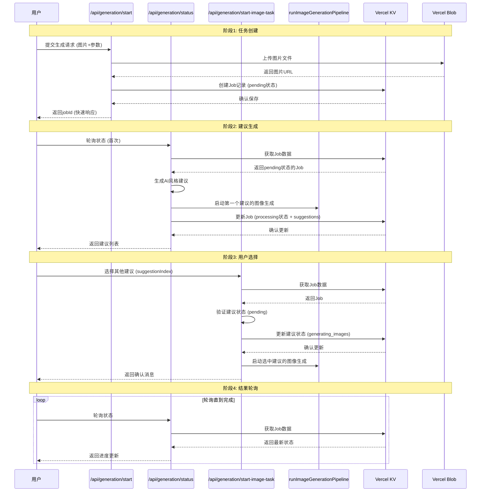

# 分阶段延迟加载架构设计

**日期**: 2025年7月28日  
**目标**: 通过分阶段处理实现快速响应和按需加载，优化用户体验和资源利用

## 1. 设计原理

### 核心思想
将传统的"一次性处理所有内容"改为"分阶段按需处理"，实现：
- **快速响应**: 任务创建立即返回，不等待AI处理
- **按需加载**: 只生成用户关心的内容，节省计算资源
- **渐进体验**: 用户先看到建议，再选择感兴趣的生成图片
- **并发控制**: 通过pipeline锁机制避免重复触发

### 架构优势

| 传统架构 | 分阶段架构 |
|---------|-----------|
| 用户等待所有处理完成 | 立即返回jobId，异步处理 |
| 一次性生成所有内容 | 按需生成，节省资源 |
| 固定流程，无用户选择 | 用户可选择性生成 |
| 容易超时和失败 | 容错性强，可重试 |

## 2. 分阶段处理详解

### 阶段1: `/api/generation/start/route.ts` - 任务创建阶段

**功能**: 创建全新的图像生成任务
**目标**: 快速响应，最小化必要工作

```typescript
// 创建初始Job，状态为'pending'，无suggestions
const newJob: Job = {
  jobId,
  userId,
  status: 'pending', // 初始状态
  suggestions: [], // 空数组，后续生成
  input: {
    humanImage: { url: humanImageBlob.url, ... },
    garmentImage: { url: garmentImageBlob.url, ... },
    generationMode,
    occasion,
    userProfile,
    customPrompt,
    stylePrompt,
  },
  createdAt: now,
  updatedAt: now,
};

// 被注释掉的pipeline调用
// runImageGenerationPipeline(jobId, 0);
// console.log(`[Job ${jobId}] Background pipeline started for suggestion 0.`);
```

**为什么pipeline被注释掉**:
- 只做**最小必要工作**: 上传图片、创建Job记录
- Job初始状态为`'pending'`，suggestions数组为**空**
- 注释中说明："AI processing will start on first status poll"
- 目的是**快速响应**用户请求，立即返回jobId

### 阶段2: `/api/generation/status/route.ts` - 建议生成阶段

**功能**: 生成AI风格建议，自动启动第一个建议的图像生成
**目标**: 提供初始内容，引导用户交互

```typescript
// 当首次查询状态时，生成AI建议
if (job.status === 'pending') {
  console.log(`[API_STATUS | Job ${job.jobId.slice(-8)}] 🔄 Job is 'pending'. Fetching AI style suggestions...`);
  
  // 1. 获取AI风格建议
  const aiSuggestions = await getStyleSuggestionFromAI({...});
  
  // 2. 创建suggestions数组，每个初始状态为'pending'
  job.suggestions = aiSuggestions.map((suggestion, index) => ({
    index,
    status: 'pending', // 每个建议初始为pending
    styleSuggestion: suggestion,
    personaProfile: {},
    finalPrompt: "Generated styling suggestion",
  }));

  // 3. 自动启动第一个建议的图像生成
  if (job.suggestions[0]) {
    console.log(`[API_STATUS | Job ${job.jobId.slice(-8)}] 🚀 Auto-triggering first suggestion after AI suggestions generated.`);
    job.suggestions[0].status = 'generating_images';
    
    // 立即启动pipeline
    runImageGenerationPipeline(job.jobId, 0);
    console.log(`[API_STATUS | Job ${job.jobId.slice(-8)}] 🚀 Pipeline started in background for suggestion 0.`);
  }
}
```

**关键设计**:
- 自动启动**第一个建议**的图像生成
- 其他建议保持`'pending'`状态
- 用户可立即看到文字建议，同时第一个建议开始生成图片

### 阶段3: `/api/generation/start-image-task/route.ts` - 用户选择阶段

**功能**: 为特定建议启动图像生成任务
**目标**: 按需处理，用户控制

```typescript
// 检查目标建议状态
if (job.suggestions[suggestionIndex]?.status !== 'pending') {
  const currentStatus = job.suggestions[suggestionIndex]?.status || 'not found';
  console.log(`[API | start-image-task] Suggestion ${suggestionIndex} is not pending (status: ${currentStatus}). Ignoring request.`);
  return NextResponse.json({ message: `Suggestion is already being processed or is complete. Status: ${currentStatus}` });
}

// 更新状态并启动pipeline
job.suggestions[suggestionIndex].status = 'generating_images';
job.updatedAt = Date.now();

await kv.set(jobId, job);
console.log(`[API | start-image-task] Updated suggestion ${suggestionIndex} status to 'generating_images'.`);

// 使用共享的pipeline runner
runImageGenerationPipeline(jobId, suggestionIndex);
console.log(`[API | start-image-task] Background pipeline started for suggestion ${suggestionIndex}.`);
```

**触发场景**:
- 用户在UI中选择一个状态为pending的suggestion
- 从`useGeneration.ts`的`selectSuggestion`函数调用

## 3. 完整工作流程

### 前端调用流程

```typescript
// 1. 用户发起生成请求
const startGeneration = async () => {
  const response = await fetch("/api/generation/start", {
    method: "POST",
    body: formData, // 包含图片、场合、模式等
  });
  const { jobId } = await response.json();
  // 立即获得jobId，开始轮询
};

// 2. 轮询状态，获取建议
const onPollingUpdate = (job: Job) => {
  if (job.suggestions.length > 0) {
    // 显示建议列表
    setSuggestions(job.suggestions);
  }
};

// 3. 用户选择特定建议
const selectSuggestion = async (index: number) => {
  const selected = suggestions[index];
  if (selected.status === 'pending') {
    // 调用start-image-task启动图像生成
    const response = await fetch('/api/generation/start-image-task', {
      method: 'POST',
      headers: { 'Content-Type': 'application/json' },
      body: JSON.stringify({ jobId: currentJob.jobId, suggestionIndex: index }),
    });
  }
};
```

### 后端处理流程

```typescript
// 1. 任务创建 (start/route.ts)
POST /api/generation/start
├── 上传图片到blob存储
├── 创建Job对象 (status: 'pending', suggestions: [])
├── 进行用户任务数量限制检查
└── 返回jobId (快速响应)

// 2. 状态查询 (status/route.ts)  
GET /api/generation/status?jobId=xxx
├── 检查job状态
├── 如果pending: 生成AI建议
├── 自动启动第一个建议的图像生成
└── 返回建议列表

// 3. 用户选择 (start-image-task/route.ts)
POST /api/generation/start-image-task
├── 验证建议状态
├── 更新状态为'generating_images'
├── 启动图像生成pipeline
└── 返回确认消息
```

## 4. 时序图



## 5. 并发控制机制

### Pipeline锁机制

```typescript
// 防止重复执行的锁机制
const pipelineLockKey = `pipeline_lock:${jobId}:${suggestionIndex}`;
const existingLock = await kv.get(pipelineLockKey);
if (existingLock) {
  console.log(`[PIPELINE_RUNNER] ⚠️ PIPELINE ALREADY RUNNING - Skipping duplicate execution`);
  return;
}

// 设置pipeline运行锁 (5分钟过期)
await kv.set(pipelineLockKey, `started_at_${Date.now()}`, { ex: 300 });
```

### 状态检查机制

```typescript
// 检查建议状态，避免重复处理
if (suggestionToProcess.status === 'succeeded' || suggestionToProcess.status === 'failed') {
  console.log(`[PIPELINE_RUNNER] ⚠️ Suggestion ${suggestionIndex} already processed (${suggestionToProcess.status}) - Skipping`);
  await kv.del(pipelineLockKey);
  return;
}
```

## 6. 性能优化效果

### 响应时间对比

| 指标 | 传统架构 | 分阶段架构 |
|------|---------|-----------|
| 任务创建响应时间 | 30-90秒 | < 2秒 |
| 首次内容展示 | 等待所有处理完成 | 立即显示建议 |
| 用户交互性 | 无 | 可选择感兴趣的建议 |
| 资源利用率 | 一次性消耗所有资源 | 按需分配资源 |

### 用户体验提升

1. **即时反馈**: 用户提交后立即获得jobId，知道请求已被接收
2. **渐进式内容**: 先看到文字建议，再选择生成图片
3. **选择性生成**: 只生成用户关心的内容，避免浪费
4. **容错性强**: 单个建议失败不影响其他建议

## 7. 实施建议

### 监控指标

```typescript
// 关键性能指标
const metrics = {
  taskCreationTime: 'start API响应时间',
  firstSuggestionTime: '首次建议生成时间', 
  userSelectionTime: '用户选择到启动时间',
  pipelineExecutionTime: 'pipeline执行时间',
  overallCompletionTime: '整体完成时间'
};
```

### 错误处理

```typescript
// 各阶段的错误恢复机制
const errorHandling = {
  taskCreation: '重试上传，清理部分数据',
  suggestionGeneration: '重试AI调用，降级到简单建议',
  pipelineExecution: '重试pipeline，清理锁状态',
  userSelection: '验证状态，防止重复触发'
};
```

## 8. 外部LLM模型调用阶段分析

### OpenAI API调用阶段

#### 阶段2: 建议生成阶段 (`/api/generation/status/route.ts`)

**调用时机**: 首次状态查询时，当Job状态为`'pending'`
**调用函数**: `getStyleSuggestionFromAI()`
**API端点**: `openai.chat.completions.create()`
**模型**: `gpt-4o`

```typescript
// 在status/route.ts中调用
const aiSuggestions = await getStyleSuggestionFromAI(
  {
    humanImageUrl: job.input.humanImage.url,
    garmentImageUrl: job.input.garmentImage.url,
    occasion: job.input.occasion,
    userProfile: userProfile,
    stylePrompt: job.input.stylePrompt, // 场景风格提示
    customPrompt: job.input.customPrompt, // 用户自定义需求
  },
  { count: 3 } // 生成3个建议
);
```

**功能**: 
- 分析用户照片和服装图片
- 生成3套不同的风格建议
- 为每个建议生成`image_prompt`用于后续图像生成
- 返回结构化的JSON建议

**输入数据**:
- 用户照片URL
- 服装图片URL  
- 场合信息
- 用户画像数据
- 场景风格提示
- 用户自定义需求

**输出数据**:
```typescript
{
  suggestions: [
    {
      outfit_suggestion: {
        outfit_title: "优雅商务风",
        explanation: "适合办公室的正式搭配...",
        items: { tops: [...], bottoms: [...] }
      },
      image_prompt: "A professional woman in business attire..."
    },
    // ... 其他2个建议
  ]
}
```

### Kling AI API调用阶段

#### 阶段3: 图像生成阶段 (`runImageGenerationPipeline`)

**调用时机**: 用户选择建议后，或自动启动第一个建议时
**调用函数**: `runStylizationMultiple()` 和 `runVirtualTryOnMultiple()`

##### 风格化阶段 (Stylization)

**API端点**: `/v1/images/generations`
**模型**: `kling-v1-5` 或 `kling-v2`
**调用函数**: `runStylizationMultiple()`

```typescript
// 在pipeline中调用
const stylizationResult = await runStylizationMultiple(
  'kling-v1-5', // 或 'kling-v2'
  suggestion, // 包含image_prompt的建议
  job.input.humanImage.url,
  job.input.humanImage.name,
  job.input.humanImage.type,
  job
);
```

**功能**:
- 使用OpenAI生成的`image_prompt`
- 将用户照片进行风格化处理
- 生成场景化的背景和姿势
- 返回风格化图片URLs

**输入数据**:
- 用户照片 (Base64编码)
- 风格化提示词 (来自OpenAI的image_prompt)
- 模型版本选择

**输出数据**:
```typescript
{
  imageUrls: ["https://...", "https://..."],
  finalPrompt: "完整的最终提示词"
}
```

##### 虚拟试穿阶段 (Virtual Try-On)

**API端点**: `/v1/images/kolors-virtual-try-on`
**模型**: `kolors-virtual-try-on-v1-5`
**调用函数**: `runVirtualTryOnMultiple()`

```typescript
// 在pipeline中调用
const tryOnImageUrls = await runVirtualTryOnMultiple(
  styledImageUrl, // 风格化后的图片作为画布
  job.input.garmentImage.url, // 服装图片
  job.input.garmentImage.name,
  job.input.garmentImage.type
);
```

**功能**:
- 将服装虚拟试穿到风格化图片上
- 保持服装的原始特征
- 生成最终的试穿效果图

**输入数据**:
- 风格化图片 (作为画布)
- 服装图片 (Base64编码)
- 试穿模型参数

**输出数据**:
```typescript
["https://tryon-image-1.jpg", "https://tryon-image-2.jpg"]
```

### 不同生成模式的API调用差异

#### 1. Try-On Only模式
```typescript
// 只调用虚拟试穿API
const tryOnImageUrls = await runVirtualTryOnMultiple(
  job.input.humanImage.url, // 直接在原始人像上试穿
  job.input.garmentImage.url,
  job.input.garmentImage.name,
  job.input.garmentImage.type
);
```

#### 2. Simple Scene模式
```typescript
// 1. 先调用风格化API
const stylizationResult = await runStylizationMultiple(...);
// 2. 再对每个风格化图片调用虚拟试穿API
for (const styledImage of stylizationResult.imageUrls) {
  const tryOnImages = await runVirtualTryOnMultiple(styledImage, ...);
}
```

#### 3. Advanced Scene模式
```typescript
// 1. 使用高级模型进行风格化
const stylizationResult = await runStylizationMultiple('kling-v2', ...);
// 2. 对每个风格化图片进行虚拟试穿
for (const styledImage of stylizationResult.imageUrls) {
  const tryOnImages = await runVirtualTryOnMultiple(styledImage, ...);
}
// 3. 可选：人脸替换 (Face Swap API)
for (const tryOnImage of allTryOnImages) {
  const swappedImage = await runFaceSwap(tryOnImage, ...);
}
```

### API调用成本分析

| 阶段 | API调用 | 模型 | 成本 | 频率 |
|------|---------|------|------|------|
| 建议生成 | OpenAI GPT-4o | gpt-4o | 中等 | 每任务1次 |
| 风格化 | Kling AI | kling-v1-5/v2 | 高 | 每建议1次 |
| 虚拟试穿 | Kling AI | kolors-virtual-try-on-v1-5 | 最高 | 每风格化图片1次 |
| 人脸替换 | Face Swap API | - | 中等 | 可选 |

### 环境控制机制

#### 开发环境优化
```typescript
// 在开发环境中，虚拟试穿API被模拟
if (process.env.MOCK_VIRTUAL_TRYON === 'true') {
  // 返回模拟的试穿图片
  return mockTryOnImageUrls;
} else {
  // 调用真实的Kling AI API
  return await executeKlingTask(KOLORS_VIRTUAL_TRYON_SUBMIT_PATH, ...);
}
```

#### 生产环境
- 所有API调用都是真实的
- 完整的图像生成流程
- 实时成本监控

这种分阶段延迟加载架构实现了**用户体验**和**资源效率**的最佳平衡，是现代AI应用的最佳实践。 