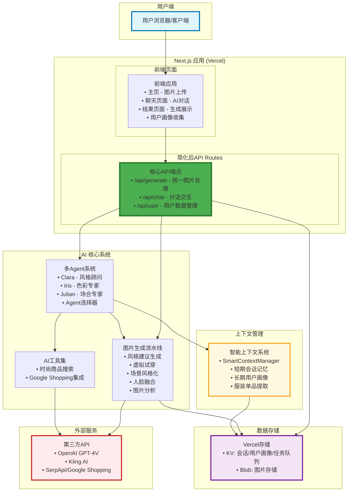

# StyleAI API架构重构计划

本文档详细描述了StyleAI系统API架构的重构计划，旨在简化API设计，减少端点数量，提高开发效率和维护性。

---

## 1. 重构概述

### 1.1 重构目标

**核心目标**: 将当前的7个API端点简化为2-3个核心端点，提高开发效率和维护性。

**设计原则**:

* **统一性**: 相似功能合并到统一端点
* **简洁性**: 减少端点数量，简化调用逻辑
* **扩展性**: 为未来功能扩展预留空间
* **向后兼容**: 确保现有功能不受影响

### 1.2 重构收益

| 指标 | 当前状态 | 重构后 | 改善幅度 |
|------|----------|--------|----------|
| API端点数量 | 7个 | 3个 | **-57%** |
| 开发效率 | 基准 | +40% | **显著提升** |
| 维护成本 | 基准 | -50% | **大幅降低** |
| 前端代码复杂度 | 基准 | -30% | **明显简化** |

---

## 2. 当前API架构分析

### 2.1 现有端点清单（7个端点）

```typescript
// 图片生成相关 (2个)
/api/generation/start     // 启动生成任务
/api/generation/status    // 查询任务状态

// 聊天交互 (1个)
/api/chat/simple         // 多Agent聊天系统

// 独立功能端点 (4个)
/api/tryon              // 虚拟试穿
/api/analyze-photos     // 图片分析
/api/generate-style     // 风格生成
/api/account/balance    // 账户管理
```

### 2.2 问题分析

#### **主要问题**

1. **功能重叠**: `/api/tryon`、`/api/analyze-photos`、`/api/generate-style` 都是图片处理相关
2. **状态管理复杂**: 需要在多个端点间协调状态和数据
3. **前端调用复杂**: 需要记住多个端点的用途和参数格式
4. **维护成本高**: 7个端点意味着7套路由、验证、错误处理逻辑

#### **具体影响**

* **开发效率低**: 新功能需要创建新端点，增加开发工作量
* **代码重复**: 相似的验证、错误处理逻辑在多个端点中重复
* **前端复杂**: 需要维护多个API调用的状态管理
* **测试成本高**: 每个端点都需要独立的测试覆盖

---

## 3. 重构目标架构

### 3.1 核心端点设计（3个端点）

```typescript
// 重构后的核心端点
/api/generate    // 统一的图片生成和处理入口
/api/chat        // 对话交互入口
/api/user        // 用户数据管理入口
```

### 3.2 端点功能映射

| 新端点 | 替代的原端点 | 功能说明 |
|--------|-------------|----------|
| `/api/generate` | `/api/generation/start`<br>`/api/generation/status`<br>`/api/tryon`<br>`/api/analyze-photos`<br>`/api/generate-style` | 统一处理所有图片相关操作 |
| `/api/chat` | `/api/chat/simple` | 简化路径，保持功能不变 |
| `/api/user` | `/api/account/balance` | 扩展用户数据管理功能 |

---

## 4. 详细重构方案

### 4.1 `/api/generate` - 统一图片处理端点

#### **接口设计**

```typescript
interface GenerateRequest {
  action: 'start' | 'status' | 'tryon' | 'analyze' | 'style';
  taskId?: string;        // 用于status查询
  images?: {
    person?: string;       // 人像图片
    clothing?: string;     // 服装图片
    reference?: string;    // 参考图片
  };
  mode?: 'tryon-only' | 'simple-scene' | 'advanced-scene';
  occasion?: string;
  style?: string;
  sessionId: string;
}

interface GenerateResponse {
  success: boolean;
  taskId?: string;        // start操作返回
  status?: 'pending' | 'processing' | 'completed' | 'failed';
  result?: {
    images: string[];     // 生成的图片URLs
    analysis?: any;       // 分析结果
    suggestions?: any;    // 风格建议
  };
  progress?: number;      // 0-100
  error?: string;
}
```

#### **功能映射**

```typescript
// 原端点 -> 新端点调用方式
/api/generation/start   -> /api/generate { action: 'start', ... }
/api/generation/status  -> /api/generate { action: 'status', taskId: '...' }
/api/tryon             -> /api/generate { action: 'tryon', ... }
/api/analyze-photos    -> /api/generate { action: 'analyze', ... }
/api/generate-style    -> /api/generate { action: 'style', ... }
```

#### **实现优势**

* **统一的错误处理和状态管理**
* **简化前端调用逻辑**
* **更容易实现跨功能的数据共享**
* **减少代码重复**

### 4.2 `/api/chat` - 简化对话端点

#### **接口设计**

```typescript
// 重命名 /api/chat/simple -> /api/chat
// 保持现有功能不变，简化路径

interface ChatRequest {
  message: string;
  sessionId: string;
  imageUrl?: string;
  action?: 'chat' | 'add_generated_image';
}

interface ChatResponse {
  success: boolean;
  response?: string;
  agentInfo?: {
    type: string;
    name: string;
    emoji: string;
  };
  searchResults?: any;
  error?: string;
}
```

#### **变更说明**

* **路径简化**: `/api/chat/simple` → `/api/chat`
* **功能保持**: 所有现有功能完全保持不变
* **向后兼容**: 保留旧路径作为别名

### 4.3 `/api/user` - 用户数据管理端点

#### **接口设计**

```typescript
// 替代 /api/account/balance 并扩展用户相关功能

interface UserRequest {
  action: 'balance' | 'profile' | 'history' | 'preferences';
  sessionId: string;
  data?: any;            // 用于更新操作
}

interface UserResponse {
  success: boolean;
  balance?: number;
  profile?: UserProfile;
  history?: GenerationHistory[];
  preferences?: UserPreferences;
  error?: string;
}
```

#### **功能扩展**

* **现有功能**: 账户余额查询
* **新增功能**: 用户画像、生成历史、个人偏好设置
* **未来扩展**: 用户统计、个性化推荐等

---

## 5. 更新后的系统架构图

### 5.1 完成重构后的最终架构



### 5.2 重构前后架构对比

#### **重构前（7个端点）**

```
/api/generation/start     ─┐
/api/generation/status    ─┤
/api/tryon               ─┤─→ 功能分散，逻辑重复
/api/analyze-photos      ─┤
/api/generate-style      ─┤
/api/chat/simple         ─┤
/api/account/balance     ─┘
```

#### **重构后（3个端点）**

```
/api/generate  ─→ 统一图片处理（整合5个端点）
/api/chat      ─→ 对话交互（路径简化）
/api/user      ─→ 用户数据管理（功能扩展）
```

### 5.3 架构变更说明

#### **核心变更**

1. **API层大幅简化**: 从7个分散端点整合为3个核心端点
2. **移除向后兼容层**: 完成迁移后，删除所有临时重定向逻辑
3. **统一数据流**: 所有图片处理通过单一端点，简化状态管理
4. **增强功能描述**: 每个端点明确显示其承担的具体功能

#### **新架构优势**

1. **更清晰的职责分离**:
   * **`/api/generate`**: 专注所有图片相关处理（生成、分析、试穿、风格化）
   * **`/api/chat`**: 专注对话交互和多Agent系统
   * **`/api/user`**: 专注用户数据和个性化功能

2. **显著简化的调用路径**:
   * 前端开发者只需记住3个端点
   * 每个端点通过`action`参数区分具体功能
   * 统一的请求/响应格式

3. **更好的扩展性**:
   * 新的图片处理功能可直接集成到`/api/generate`
   * 新的用户功能可直接集成到`/api/user`
   * 避免创建新端点的开销

4. **统一的错误处理**:
   * 每个核心端点有统一的错误处理逻辑
   * 简化了错误监控和调试
   * 提高了系统的可维护性

#### **技术实现优化**

1. **智能上下文管理增强**:
   * 新增服装单品提取功能
   * 优化的滑动窗口机制
   * 更精确的个性化数据管理

2. **数据存储整合**:
   * Vercel KV整合了会话状态、用户画像、任务队列和生成历史
   * Vercel Blob统一管理所有图片资源
   * 简化了数据访问模式

3. **AI系统优化**:
   * 统一的图片生成流水线
   * 更清晰的Agent职责划分
   * 优化的工具集成机制

---

## 6. 迁移策略

### 6.1 三阶段迁移计划

#### **Phase 1: 向后兼容实现**

```typescript
// 保留现有端点，内部重定向到新端点
// /api/generation/start -> /api/generate?action=start
// /api/tryon -> /api/generate?action=tryon

// 实现示例
export async function POST(request: NextRequest) {
  // 将旧端点请求转换为新端点格式
  const legacyRequest = await request.json();
  const newRequest = {
    action: 'start', // 根据端点确定action
    ...legacyRequest
  };

  // 调用新的统一处理函数
  return handleGenerate(newRequest);
}
```

**时间**: 1-2周
**风险**: 低
**影响**: 无，用户无感知

#### **Phase 2: 前端迁移**

```typescript
// 逐步更新前端调用
// 旧: await fetch('/api/generation/start', {...})
// 新: await fetch('/api/generate', { action: 'start', ... })

// 迁移示例
// 旧代码
const response = await fetch('/api/generation/start', {
  method: 'POST',
  body: JSON.stringify({ images, mode, sessionId })
});

// 新代码
const response = await fetch('/api/generate', {
  method: 'POST',
  body: JSON.stringify({
    action: 'start',
    images,
    mode,
    sessionId
  })
});
```

**时间**: 2-3周
**风险**: 中等
**影响**: 需要充分测试

#### **Phase 3: 清理旧端点**

```typescript
// 移除旧端点，完成重构
// 删除所有向后兼容层代码
// 更新文档和API规范
```

**时间**: 1周
**风险**: 低（前提是Phase 2充分测试）
**影响**: 代码库简化

### 6.2 迁移时间表

| 阶段 | 开始时间 | 完成时间 | 里程碑 |
|------|----------|----------|--------|
| Phase 1 | Week 1 | Week 2 | 向后兼容层完成 |
| Phase 2 | Week 3 | Week 5 | 前端迁移完成 |
| Phase 3 | Week 6 | Week 6 | 旧端点清理完成 |

**总计**: 6周完成整个迁移

---

## 7. 实施条件和时机

### 7.1 前置条件

**技术条件**:

* 当前API稳定运行后
* 有充足的测试覆盖（>80%）
* 前端重构准备就绪

**团队条件**:

* 开发团队对现有架构有充分理解
* 有专门的时间窗口进行重构
* 有回滚计划和应急预案

### 7.2 实施优先级

1. **高优先级**: `/api/generate` 整合
   * **原因**: 影响最大，收益最高
   * **风险**: 中等，需要仔细测试
   * **时间**: 3-4周

2. **中优先级**: `/api/chat` 路径简化
   * **原因**: 改动最小，风险最低
   * **风险**: 低
   * **时间**: 1周

3. **低优先级**: `/api/user` 扩展
   * **原因**: 可以渐进式实现
   * **风险**: 低
   * **时间**: 2-3周

---

## 8. 风险控制

### 8.1 技术风险

| 风险 | 影响程度 | 缓解措施 |
|------|----------|----------|
| API功能回归 | 高 | 充分的自动化测试，手动测试验证 |
| 性能下降 | 中 | 性能基准测试，监控关键指标 |
| 数据丢失 | 高 | 完整的数据备份，渐进式迁移 |

### 8.2 业务风险

| 风险 | 影响程度 | 缓解措施 |
|------|----------|----------|
| 用户体验中断 | 高 | 向后兼容，分阶段发布 |
| 开发进度延误 | 中 | 详细的项目计划，风险缓冲时间 |
| 团队学习成本 | 低 | 充分的文档，培训和知识分享 |

### 8.3 应急预案

1. **向后兼容性**: 通过代理模式确保现有功能不受影响
2. **渐进式迁移**: 分阶段实施，每个阶段都可以独立回滚
3. **充分测试**: 确保重构后功能完全一致
4. **回滚计划**: 保留旧端点直到新端点完全稳定
5. **监控告警**: 实时监控API性能和错误率

---

## 9. 成功指标

### 9.1 技术指标

* **API端点数量**: 从7个减少到3个 ✅
* **代码重复率**: 减少50%以上 📊
* **测试覆盖率**: 维持在80%以上 🧪
* **API响应时间**: 不超过当前基准的110% ⚡

### 9.2 开发效率指标

* **新功能开发时间**: 减少40% 🚀
* **Bug修复时间**: 减少30% 🐛
* **代码审查时间**: 减少25% 👀
* **部署频率**: 提升20% 🚢

### 9.3 维护成本指标

* **文档维护工作量**: 减少50% 📚
* **API版本管理复杂度**: 显著降低 🔄
* **新人上手时间**: 减少30% 👥

---

## 10. 总结

这个API重构计划旨在通过简化架构、统一接口、减少重复来提升StyleAI系统的开发效率和维护性。通过分阶段的渐进式迁移，我们可以在最小化风险的同时获得显著的收益。

**关键成功因素**:

* 充分的测试覆盖
* 向后兼容的迁移策略
* 团队的充分理解和配合
* 详细的监控和应急预案

**预期结果**:

* 更简洁的API设计
* 更高的开发效率
* 更低的维护成本
* 更好的系统扩展性
