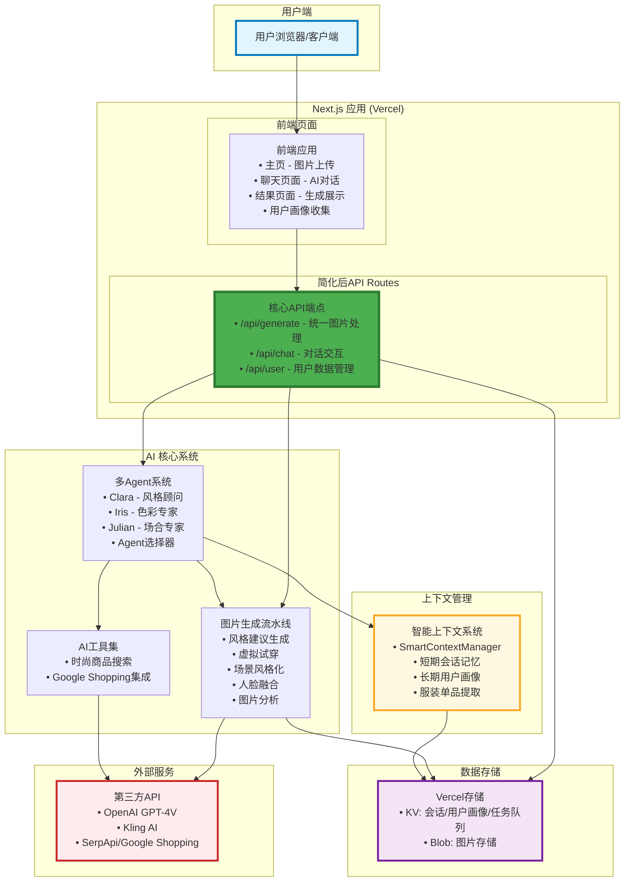

# StyleAI 综合架构与技术分析文档

本文档旨在全面阐述 StyleAI 系统的整体架构、关键技术决策和演进路径。通过整合项目中的多个设计与分析文档，本文档为开发人员提供了一个关于系统全貌的统一视图。

---

## 1. 高层架构与系统设计

StyleAI 是一个以对话式交互为核心的个性化时尚造型助手。其架构设计遵循模块化、可扩展和服务化的原则，旨在支持快速迭代和未来的功能扩展。

### 1.1 核心系统组件

系统主要由以下几个核心组件构成：

1. **前端应用 (Frontend Application)**:
    * **技术栈**: 使用 Next.js 14 App Router 和 React 构建的现代化应用。
    * **核心页面**:
        * **主页 (`/`)**: 图片上传界面，支持自拍和服装图片上传，风格选择和生成模式选择
        * **聊天页面 (`/chat`)**: AI对话交互界面，支持多Agent智能对话
        * **结果页面 (`/results`, `/result`)**: 生成结果展示和历史记录查看
        * **引导页面 (`/onboarding`)**: 用户画像收集和个性化设置
        * **我的风格 (`/my-style`)**: 个人风格档案和历史生成记录
    * **特点**: 利用 Next.js App Router 实现文件系统路由，支持服务端渲染 (SSR) 和静态站点生成 (SSG)，以优化首屏加载速度和 SEO。组件化的设计提高了代码的复用性和可维护性。

2. **后端服务 (Backend Services)**:
    * **技术栈**: 基于 Next.js API Routes 构建的 Serverless Functions。
    * **核心API端点**:
        * **`/api/generation/start`**: 启动AI图片生成任务，支持三种生成模式
        * **`/api/generation/status`**: 查询异步任务状态和结果
        * **`/api/chat/simple`**: 聊天API，集成完整的多Agent系统（Clara, Iris, Julian），支持智能Agent选择、工具调用和上下文管理
        * **`/api/tryon`**: 虚拟试穿API，直接处理试穿请求
        * **`/api/analyze-photos`**: 图片分析API，提取服装和风格信息
        * **`/api/generate-style`**: 风格生成API，基于用户偏好生成建议
        * **`/api/account/balance`**: 账户管理API，处理用户余额和使用统计
    * **特点**: 无服务器 (Serverless) 架构使得后端服务可以根据请求量自动扩展，降低了运维复杂性和成本。

3. **AI 核心 (AI Core)**:
    * **多Agent系统**: 基于 LangChain 框架构建，包含三个专业化Agent：
        * **Clara (风格顾问)**: 专注于整体造型建议和风格分析
        * **Iris (色彩专家)**: 专注于色彩搭配和肤色适配分析
        * **Julian (场合专家)**: 专注于不同场合的着装要求和礼仪
        * **Agent选择器**: 基于用户输入进行意图识别和Agent调度
    * **AI工具集**:
        * **图片分析工具**: 使用OpenAI GPT-4V分析用户上传的服装图片
        * **时尚商品搜索工具**: 集成Google Shopping API进行商品搜索
        * **智能上下文管理**: 管理对话历史和用户画像
    * **图片生成流水线**:
        * **风格建议生成**: 使用OpenAI GPT-4V分析图片并生成个性化建议
        * **虚拟试穿**: 集成Kling AI API实现高质量虚拟试穿
        * **场景风格化**: 使用Kling AI进行场景化风格渲染
        * **人脸融合**: 内部算法实现人脸替换和融合
    * **三种生成模式**:
        * **仅试穿模式 (tryon-only)**: 纯虚拟试穿，保持原始背景
        * **简单场景模式 (simple-scene)**: 试穿+简单场景风格化
        * **高级场景模式 (advanced-scene)**: 试穿+风格化+人脸融合的完整流水线

4. **数据存储与状态管理 (Data Storage & State Management)**:
    * **Vercel KV**: 存储会话状态、用户画像、对话历史和任务状态
    * **Vercel Blob**: 存储用户上传图片、AI生成图片和中间处理结果
    * **任务队列**: 基于Vercel KV实现的异步任务状态管理
    * **智能上下文管理系统**:
        * **短期会话记忆**: 存储在内存中，记录当前对话的最近几轮交互，保证对话的即时流畅性。

            **🔧 核心实现**：
            * **SmartContextManager**: 负责管理会话级别的上下文逻辑
            * **滑动窗口机制**: 维护最近 10 条消息，自动清理过期对话
            * **消息类型**: 支持文本、图片上传、图片生成等不同类型的消息

            **🧠 智能上下文管理**：
            * **滑动窗口机制**: 维护最近 10 条消息（`MAX_HISTORY = 10`），自动清理过期对话
            * **会话信息跟踪**: 实时更新会话状态信息
                * `lastGeneratedImage`: 最后生成的图片URL
                * `lastUploadedImage`: 最后上传的图片URL
                * `activeDiscussionTopic`: 当前讨论主题（自动推断）
                * `mentionedClothingItems`: 提及的服装单品列表
                * `lastActiveAgent`: 最后活跃的AI Agent
                * `compressionStats`: 图片压缩统计信息

        * **长期用户画像**: 存储用户的风格偏好和个人特征
        * **智能上下文注入**: 根据当前查询智能选择相关上下文信息

5. **基础设施与部署 (Infrastructure & Deployment)**:
    * **平台**: 主要部署在 Vercel 平台，充分利用其对 Next.js 的原生支持和全球 Edge 网络。
    * **外部服务集成**:
        * **OpenAI API**: GPT-4V模型用于图片分析和风格建议生成
        * **Kling AI API**: 专业的AI图片生成和虚拟试穿服务
        * **SerpApi**: Google Shopping API集成，提供商品搜索功能
    * **部署**: 通过 Vercel 的 CI/CD 流水线实现自动化部署。

### 1.2 系统架构图

---

## 2. 技术分析文档

本部分深入探讨系统实现过程中的关键技术路径、决策权衡、遇到的挑战及解决方案。

### 2.1 关键业务路径 (Critical Paths)

1. **AI聊天与智能建议**:
    * **流程**: 用户在聊天页面输入问题 -> 前端调用 `/api/chat/simple` -> ChatAgent类接收请求 -> Agent选择器基于关键词匹配选择合适的Agent (Clara/Iris/Julian) -> 选中的Agent使用相应工具 (图片分析工具、时尚搜索工具) -> 智能上下文管理器注入相关历史和用户画像 -> Agent生成个性化回复 -> 返回结构化响应 (包含Agent信息、回复内容、搜索结果)
    * **关键点**: 多Agent系统根据用户意图智能调度专业Agent，结合工具调用和上下文管理提供个性化建议。所有聊天功能都通过统一的 `/api/chat/simple` 端点处理，内部集成完整的多Agent系统。

2. **图片生成与虚拟试穿**:
    * **流程**: 用户在主页上传人像和服装图片，选择场合和生成模式 -> 前端调用 `/api/generation/start` -> 后端上传图片到Vercel Blob -> 使用OpenAI GPT-4V生成风格建议 -> 创建任务记录存储到Vercel KV -> 立即返回任务ID -> 后台异步执行对应的生成流水线 (tryon-only/simple-scene/advanced-scene) -> 前端通过 `/api/generation/status` 轮询任务状态 -> 任务完成后返回最终图片URL -> 前端展示结果并保存到历史记录
    * **关键点**: 异步任务处理机制支持耗时的AI图片生成，三种生成模式满足不同用户需求，从简单试穿到复杂场景化处理。

3. **用户画像构建与个性化**:
    * **流程**: 用户访问引导页面 (`/onboarding`) -> 收集用户基本信息、风格偏好、身体特征等 -> 存储到Vercel KV作为用户画像 -> 在后续聊天和生成过程中，智能上下文管理器会检索并注入相关的用户画像信息 -> AI Agent根据个人档案提供更精准的建议
    * **关键点**: 通过结构化的用户画像收集，为AI系统提供个性化上下文，提升建议的准确性和相关性。

4. **商品搜索与推荐**:
    * **流程**: 用户在聊天中询问商品推荐 -> Agent识别搜索意图 -> 调用时尚商品搜索工具 -> 工具通过SerpApi调用Google Shopping API -> 获取相关商品数据 -> Agent基于搜索结果和用户画像生成个性化推荐 -> 返回包含商品信息的结构化回复
    * **关键点**: 集成真实的购物数据，结合AI分析提供个性化的商品推荐，打通从建议到购买的完整链路。

### 2.2 技术路径权衡与决策

1. **为何选择 LangChain 构建多 Agent 系统？**
    * **模块化与可扩展性**: 这是最重要的原因。相比于一个庞大的单体模型，多 Agent 架构允许我们将不同的 AI 能力封装在独立的、可复用的 Agent 中（如图片生成、购物、造型建议、图片解读）。这使得添加新功能（即新的 Agent）变得非常简单，而不会影响现有逻辑。
    * **任务专业化**: 每个 Agent 可以拥有自己独特的 Prompt、工具集和记忆，专注于解决特定领域的问题，从而提高任务完成的质量和效率。
    * **简化的工具集成**: LangChain 提供了标准化的工具（Tools）接口，可以轻松地将外部 API（如 Google Shopping）或内部函数封装为 Agent 可调用的工具，大大简化了 AI 与外部世界的连接。

2. **上下文 (Context) 管理策略的深度解析**
    * **核心挑战**: LLM 的成功极度依赖于高质量的上下文，但其上下文窗口是有限且昂贵的。如何在保持对话个性化和连贯性的同时，避免发送冗余信息，是优化成本和性能的关键。
    * **分层记忆系统 (Tiered Memory System)**: 我们设计并实现了一套分层记忆系统来应对这一挑战，该系统在 `smart-context-management-design.md` 中有详细阐述。
        * **短期会话记忆 (Short-term Session Memory)**: 存储在 Vercel KV 中，记录当前对话的最近几轮交互。这保证了对话的即时流畅性，让 AI 能记住用户"刚刚说了什么"。
        * **长期用户画像 (Long-term User Profile)**: 将从对话中提炼出的用户核心信息——如风格偏好（"喜欢波西米亚风格"）、个人特征（"有即将到来的海滩假期"）、历史互动摘要等——进行结构化处理，并同样存储于 Vercel KV。这构成了用户的持久化档案。
        * **智能上下文注入 (Smart Context Injection)**: 这是我们策略的核心。在每次将用户请求发送给 AI Agent 之前，一个"上下文管理器"模块会执行以下操作：
            1. **检索**: 从短期记忆中提取最近的对话历史。
            2. **筛选**: 从长期用户画像中检索与当前用户查询最相关的关键信息。
            3. **压缩与组合**: 可能会对过长的对话历史进行摘要，然后将用户的当前问题、相关的短期记忆和相关的长期画像信息，智能地组合成一个紧凑而高效的上下文 (Prompt)。
        * **优势**: 这种策略取代了天真地将全部聊天记录发送给模型的做法。它确保了 Agent 在接收到请求时，总能获得最关键、最相关的信息，从而在不超出上下文窗口限制的前提下，做出最精准、最个性化的回应，同时也显著降低了 API 调用成本。

3. **存储策略与权衡**
    * **面临的决策**: 为应用选择合适的存储解决方案。选项包括传统的关系型数据库 (如 aiven for PostgreSQL), NoSQL 数据库 (如 MongoDB), 以及 Vercel 平台内建的存储方案。
    * **选择 Vercel KV 与 Vercel Blob 的理由**:
        * **Vercel KV (键值存储)**:
            * **适用场景**: 非常适合存储会话状态、用户画像、聊天记录等需要快速、低延迟读写的半结构化数据。它的键值模型对于这些场景来说，比关系型数据库更简单、更高效。
            * **架构契合度**: 与 Serverless Functions 的结合天衣无缝。在无服务器环境中管理与传统数据库的连接池可能非常复杂，而 Vercel KV 通过简单的 API 调用解决了这个问题，完美契合了项目的整体架构。
            * **避免过度工程**: 对于当前阶段的需求，引入一个功能完备的外部数据库会带来不必要的复杂性（如 schema 管理、迁移、额外的运维成本）。Vercel KV 提供了一个"恰到好处"的解决方案。
        * **Vercel Blob (对象存储)**:
            * **适用场景**: 专为存储非结构化大文件（如用户上传的图片、AI 生成的图片）而设计。
            * **成本与性能**: 将图片等大文件存储在数据库中是极其昂贵且低效的。Vercel Blob 不仅存储成本更低，还自带全球 CDN 加速，能极大地提升图片的加载速度，优化用户体验。
            * **基础设施统一**: 选择 Vercel 内建的存储方案，使得整个技术栈（从前端、后端到存储）都统一在 Vercel 平台下，简化了开发、部署、监控和计费的管理。

4. **评估 (Evaluation) 系统设计**
    * **挑战**: 如何有效、低成本地评估一个复杂的 AI 系统的表现？
    * **决策与方案** (`evaluation-system-design.md`):
        * **双轨评估体系**:
            1. **用户主观评价**: 提供极简的 "👍/👎" 按钮。这种设计的出发点是最大化用户的参与率，避免复杂的评分表单带来的用户流失。
            2. **自动化客观指标**: 自动收集关键性能指标，如**响应延迟 (Latency)**、**Token 使用量**、**Agent 选择准确率**和**外部工具调用成功率**。
        * **数据驱动迭代**: 将主观和客观数据结合分析，例如，分析哪些类型的查询导致了最多的 "👎" 评价，或者哪个 Agent 的 Token 消耗最高，从而为系统优化提供明确的数据指导。
        * **🆕 图片生成质量优化洞察**:
            * **审美偏好聚类**: 基于用户的双选择数据，识别不同的审美偏好群体（如偏爱简约风格 vs 华丽风格）
            * **生成参数优化**: 分析哪些生成参数组合更容易被用户选择，指导模型参数调优
            * **失败模式识别**: 当用户对两张图片都不满意时，分析共同的失败特征（如色彩搭配、构图问题等）
            * **个性化生成策略**: 基于用户历史选择模式，预测其偏好并调整生成策略

### 2.3 技术难题拆解与创新解决方案

1. **耗时 AI 任务的用户体验优化**
    * **当前解决方案 (客户端轮询)**:
        * **问题**: AI 图片生成等任务可能耗时数十秒甚至更久，同步等待会导致请求超时和糟糕的用户体验。
        * **解决方案** (`async-polling-design.md`): 采用**异步任务 + 客户端轮询**的模式。后端在接收到任务后，立即返回一个任务 ID。前端则启动一个定时器 (`use-interval`)，周期性地向后端查询任务状态。这种方式将长连接分解为一系列短连接，对用户来说，界面保持响应，并可以展示一个动态的加载/处理状态。
    * **未来架构升级方向 (实时推送)**:
        * **动机**: 虽然轮询机制在当前阶段是有效的，但它存在延迟（取决于轮询间隔）和资源浪费（产生大量不必要的HTTP请求）的问题。为了提供更即时、更高效的用户体验，并降低服务器负载，未来的架构将向实时推送升级。
        * **技术选型：WebSockets 或 Server-Sent Events (SSE)**:
            * **WebSockets**: 建立一个持久的双向连接。当AI任务完成时，服务器可以**主动**将结果"推送"给客户端，实现真正的实时通信。这消除了轮询的延迟和不必要的网络流量。
            * **Server-Sent Events (SSE)**: 一个更轻量级的单向推送方案。服务器可以向客户端发送事件流。对于仅需服务器向客户端通知任务完成状态的场景，SSE 是一个比 WebSockets 更简单、更专注的解决方案。
        * **升级后的工作流程**:
            1. 用户发起生成请求，客户端通过 WebSocket 或 SSE 连接到服务器。
            2. 服务器接收任务，开始后台处理。
            3. 任务处理过程中，服务器可以通过连接发送进度更新（例如，"正在生成草图..."、"正在上色..."）。
            4. 任务完成后，服务器立即通过连接将最终结果或完成信号推送给客户端。
            5. 客户端接收到推送后，立即更新UI，无需再进行任何查询。
        * **优势**: 极大提升了实时性，降低了延迟，减少了服务器和网络的负载，并为未来实现更复杂的实时交互功能（如协作编辑）奠定了基础。

2. **图片资源优化**
    * **问题**: 用户上传和 AI 生成的图片尺寸大，导致存储成本高，加载速度慢。
    * **解决方案** (`image-compression-design.md`): 建立一个自动化的图片处理流水线。当图片上传至 Vercel Blob 时，通过一个 Serverless Function 触发器，自动对图片进行**压缩**、**格式转换** (如转换为 WebP) 和**尺寸调整**（生成不同尺寸的缩略图），以适应不同场景的展示需求，从而在保证视觉质量的同时，显著降低存储和带宽成本。

### 2.4 对基础设施、可扩展性和模块化的考虑

1. **基础设施 (Infrastructure)**:
    * **Vercel 优先**: 选择 Vercel 作为主要部署平台是明智的，因为它与 Next.js 的集成是无缝的。Vercel Functions, Edge Network, KV 和 Blob 提供了一个开箱即用、高度优化的 Serverless 技术栈，让团队可以专注于业务逻辑而非底层运维。

2. **可扩展性 (Scalability)**:
    * **计算扩展**: 核心业务逻辑运行在 Serverless Functions 上，这意味着系统可以根据流量自动水平扩展。无论是处理 API 请求还是执行图片压缩，都不会有单点性能瓶颈。
    * **数据扩展**: Vercel KV 和 Blob 本身是托管在云上的可扩展服务，能够应对未来的数据增长。
    * **功能扩展**: 多 Agent 架构是功能扩展性的核心。未来增加新的 AI 功能，只需开发并注册一个新的 Agent，系统其余部分几乎无需改动。

3. **模块化 (Modularity)**:
    * **前端**: 基于 React 组件的开发模式确保了 UI 层的模块化。
    * **后端**: API Routes 将后端功能拆分为独立的、符合单一职责原则的微服务。
    * **AI 核心**: LangChain 的 Agent 和 Tool 概念是实现 AI 逻辑模块化的关键。每个 Agent 和 Tool 都是一个独立的单元，可以被独立开发、测试和替换。

通过上述设计与决策，StyleAI 构建了一个既健壮又灵活的系统，能够支持当前的业务需求，并为未来的快速发展奠定了坚实的技术基础。

### 2.5 额外的架构考虑 WIP

1. [P0]**可扩展性与性能**:
   * **负载测试**: 系统是否经过压力测试以确保能够处理峰值负载？建议实施负载测试以识别瓶颈。
   * **缓存策略**: 虽然文档提到 Vercel 的边缘网络，但详细的缓存策略（如 API 响应和静态资源的缓存）将进一步提升性能。

2. **安全性**:
   * **数据保护**: 如何保护敏感用户数据？建议对静态和传输中的数据进行加密。
   * **访问控制**: 确保有健全的认证和授权机制，特别是对于 API 端点。

3. [P0]**可观测性**:
   * **监控与日志记录**: 文档提到增强的日志系统，但详细的监控工具和告警机制将有助于快速识别和解决问题。
   * **追踪**: 实施分布式追踪以跟踪跨服务的请求，这对于调试和性能优化非常有价值。

4. [P0]**弹性与容错**:
    * **优雅降级**: 系统如何处理部分故障？建议实施回退机制以在故障期间保持核心功能。
    * **冗余**: 确保关键组件具有冗余以防止单点故障。

    **🛡️ StyleAI系统的容错设计**：

    StyleAI 系统采用多层级的弹性与容错设计，包括：

    * **多层级优雅降级机制**: AI服务降级、图片生成流水线容错、对话系统容错
    * **前端用户体验容错**: 轮询机制容错、图片处理容错
    * **监控与自愈机制**: 实时错误监控、自动恢复机制
    * **用户友好的错误处理**: 错误信息优化、用户自助恢复

    > **详细设计文档**: 完整的弹性与容错设计请参考 [`docs/Resilience_and_Fault_Tolerance_Design.md`](./Resilience_and_Fault_Tolerance_Design.md)

---

## 3. Future Improvements

以下功能和优化将在未来版本中考虑实施，当前阶段专注于核心功能的稳定运行。

### 3.1 数据飞轮优化 (Data Flywheel)

**目标**: 构建自优化的数据飞轮，让产品随着用户使用变得越来越智能。

**核心机制**:

* **数据捕获**: 收集用户显式反馈（👍/👎评价）和隐式行为（使用模式、偏好选择）
* **图片生成双选择数据**: 为每次生成返回两张候选图片，收集用户偏好数据
* **数据分析与洞察**: 识别失败模式、评估Agent表现、发现新需求
* **模型优化**: 基于用户反馈进行模型微调和个性化参数调整
* **体验增强**: 通过优化提升用户满意度和参与感

**实施条件**: 当用户基数达到一定规模，有足够数据支撑分析时考虑实施。

### 3.2 高级弹性与容错系统

**目标**: 实现企业级的系统可靠性和容错能力。

**核心功能**:

* **多层级优雅降级**: AI服务降级、图片生成流水线容错、对话系统容错
* **系统级冗余设计**: 多区域部署、服务组件冗余、数据存储冗余
* **监控与自愈**: 实时错误监控、自动恢复机制、智能告警
* **用户友好错误处理**: 分层错误提示、自助恢复选项

**实施条件**: 当系统负载和用户量达到需要企业级可靠性时实施。

**详细设计**: 参考 [`docs/Resilience_and_Fault_Tolerance_Design.md`](./Resilience_and_Fault_Tolerance_Design.md)

### 3.3 实时通信升级

**目标**: 从客户端轮询升级到实时推送机制。

**技术选型**:

* **WebSockets**: 双向实时通信，支持进度更新
* **Server-Sent Events (SSE)**: 轻量级单向推送方案

**优势**: 减少延迟、降低服务器负载、提升用户体验

**实施条件**: 当轮询机制成为性能瓶颈时考虑升级。

### 3.4 高级上下文管理

**目标**: 实现更智能的上下文理解和管理。

**功能扩展**:

* **智能主题识别**: 基于NLP的对话主题自动识别
* **多模态上下文**: 结合文本、图片、用户行为的综合上下文
* **个性化上下文权重**: 基于用户特征调整上下文重要性

**实施条件**: 当基础上下文管理稳定运行后，根据用户反馈决定是否需要更复杂的功能。

### 3.5 多Agent系统优化

**目标**: 优化Agent选择和协作机制。

**优化方向**:

* **动态Agent创建**: 根据用户需求动态生成专业Agent
* **Agent协作模式**: 多个Agent协同处理复杂问题
* **Agent性能监控**: 实时监控各Agent的表现和效果

**实施条件**: 当前三个Agent系统运行稳定后，根据实际需求考虑扩展。

### 3.6 模型的重新训练与更新

在生产环境中重新训练和更新模型是确保系统持续优化和适应用户需求变化的关键。以下是详细的步骤和策略：

1. **数据收集与准备**:
   * **数据标注**: 收集用户交互数据，并通过用户反馈（如"👍/👎"评价）进行标注。
   * **数据清洗**: 清理和预处理数据，去除噪声和不相关信息，确保数据质量。

2. **模型训练**:
   * **训练环境**: 在隔离的环境中进行模型训练，避免对生产系统的影响。
   * **超参数优化**: 使用自动化工具（如 Optuna）进行超参数调优，以提高模型性能。
   * **增量学习**: 采用增量学习技术，利用新数据对现有模型进行微调，而不是从头开始训练。

3. **模型评估**:
   * **离线评估**: 在测试数据集上评估模型性能，确保其在准确性、召回率等指标上达到预期。
   * **A/B 测试**: 在生产环境中进行 A/B 测试，比较新旧模型的表现，确保新模型的改进。

4. **模型部署**:
   * **渐进式发布**: 采用渐进式发布策略，逐步将新模型推送到生产环境，监控其表现。
   * **回滚机制**: 设置回滚机制，以便在新模型出现问题时快速恢复到旧版本。

5. **持续监控与反馈**:
   * **性能监控**: 持续监控模型在生产环境中的表现，收集性能指标和用户反馈。
   * **反馈循环**: 将监控数据和用户反馈纳入下一个训练周期，形成闭环反馈机制，推动模型的持续改进。

### 3.7 短期会话记忆

短期会话记忆: 采用内存+KV混合存储策略。内存提供快速访问，KV提供持久化保证，确保在Serverless冷启动和用户会话中断时能够恢复对话上下文。
这样既保证了性能，又解决了持久性问题，是更加务实的解决方案

| 维度 | 内存存储（当前实现） | Vercel KV存储（文档描述） |
|------|------------------------|----------------------------|
| 🚀 性能 | 极快 - 直接内存访问，无网络延迟 | 较慢 - 需要网络请求，有延迟 |
| 💾 持久性 | ❌ 不持久 - 服务重启或冷启动丢失 | ✅ 持久 - 数据永久保存 |
| 🔄 会话连续性 | ❌ 断开即丢失 - 用户刷新页面或重新访问丢失上下文 | ✅ 跨会话保持 - 用户可以继续之前的对话 |
| 💰 成本 | 免费 - 只占用内存 | 付费 - 按读写次数计费 |
| ⚡ 响应时间 | <1ms - 内存直接访问 | 10-50ms - 网络请求开销 |
| 🔧 复杂性 | 简单 - 无需额外配置 | 复杂 - 需要KV配置和错误处理 |
| 📊 扩展性 | ❌ 受限 - 单实例内存限制 | ✅ 无限 - 云存储可扩展 |
| 🛡️ 可靠性 | ❌ 易丢失 - Serverless冷启动清空 | ✅ 高可靠 - 云存储备份 |

---

## 附录：关键概念解释

为了帮助理解本文档中的技术决策，以下是一些关键概念的简要说明。

### 1. 无服务器计算 (Serverless)

一种云计算执行模型，开发者无需关心服务器的购买、配置和管理。云提供商（如 Vercel、AWS）会根据应用的实际请求量，自动地分配计算资源并进行伸缩。

* **核心优势**:
  * **降低运维负担**: 开发者可以专注于业务逻辑，而不是服务器维护。
  * **成本效益**: 按实际使用量付费，避免了为闲置资源付费。
  * **自动扩展**: 在高流量时自动扩展以保证性能，在低流量时自动缩减以节约成本。

### 2. Next.js 与 React

* **React**: 一个由 Facebook 开发的、用于构建用户界面的 JavaScript 库。它是本项目的 UI 构建基础，通过"组件化"思想，让 UI 开发变得高效且可复用。

* **Next.js**: 一个基于 React 的开源框架。它为 React 应用增加了许多生产环境必需的功能，如**服务端渲染 (SSR)**、**静态站点生成 (SSG)**、**文件系统路由**和**API 路由**等。在本项目中，Next.js 不仅构建了前端交互界面，还通过其 API Routes 功能承担了后端服务的角色。

### 3. 边缘网络 (Edge Network)

一个由地理上分散在全球各地的服务器组成的网络，旨在将内容（如网页、图片、API 响应）缓存到离最终用户尽可能近的地方。

* **核心优势**: 当用户请求资源时，请求会被路由到最近的"边缘节点"，而不是遥远的源服务器。这可以**极大地降低网络延迟**，从而显著提升应用的加载速度和响应性能。Vercel 的全球 Edge 网络是其平台的核心优势之一。

### 4. Vercel vs. Heroku 部署对比

* **Vercel**: 一个专注于前端和 Jamstack 架构的部署平台，尤其对 Next.js 提供了无与伦比的原生支持和深度优化。它无缝集成了 CI/CD、全球 Edge 网络和 Serverless Functions，是部署现代化前端项目的理想选择。

* **Heroku**: 一个更通用的平台即服务 (PaaS)，支持包括 Node.js、Ruby、Python 在内的多种后端语言和框架。它提供了强大的后端托管能力和丰富的第三方插件生态系统。

* **本项目中的考量**: 虽然 Heroku 是一个强大的平台，但 Vercel 因其与项目技术栈 (Next.js) 的完美契合而成为首选。文档中提到的 Heroku 部署失败记录，通常反映了在通用平台部署高度优化的前端框架时可能遇到的配置挑战，也反衬出选择 Vercel 的正确性。

### 5. 客户端轮询机制 (Client-side Polling)

一种客户端与服务器通信的技术模式，特别适用于处理耗时较长的异步任务（例如，本项目中的 AI 图片生成）。

* **工作流程**:
    1. 客户端向服务器发起一个任务请求。
    2. 服务器立即响应一个"任务接收成功"的消息，并附带一个唯一的**任务ID**，然后开始在后台处理这个耗时任务。
    3. 客户端在收到任务ID后，启动一个定时器，每隔几秒钟就向服务器发送一次查询请求，并附上任务ID，询问："这个任务好了吗？"
    4. 服务器返回任务的当前状态（如 "处理中"、"已完成" 或 "失败"）。
    5. 一旦服务器返回 "已完成"，客户端就停止轮询，并请求最终的结果进行展示。

* **核心优势**: 这种模式避免了因单个请求等待时间过长而导致的 HTTP 超时，同时让用户界面能够保持响应，并可以向用户展示一个友好的进度提示。
