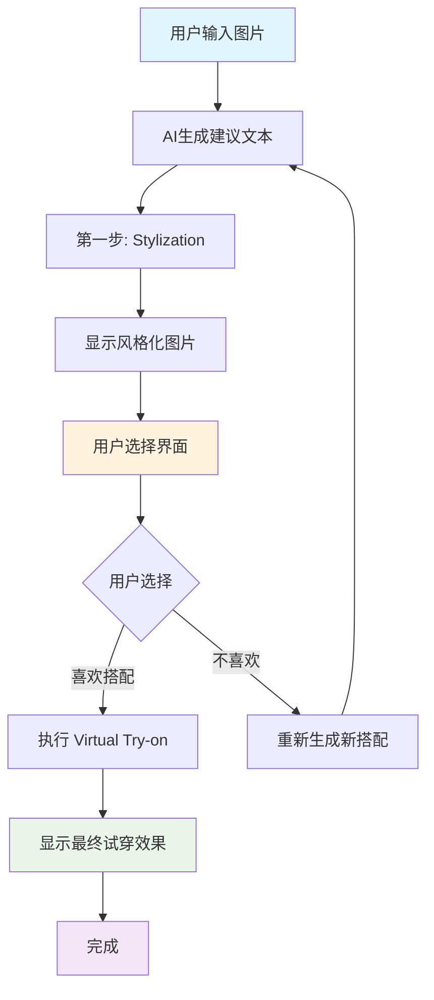

# StyleAI 交互式体验重构设计文档

本文档描述了StyleAI系统的全面重构计划，包括新的交互式用户体验、API架构简化和增量式响应设计。

---

## 📋 目录

1. [设计概述](#1-设计概述)
2. [新用户体验流程](#2-新用户体验流程)
3. [API架构重构](#3-api架构重构)
4. [增量式响应设计](#4-增量式响应设计)
5. [技术实施计划](#5-技术实施计划)
6. [风险评估与缓解](#6-风险评估与缓解)

---

## 1. 设计概述

### 1.1 重构目标

**核心目标**: 创建更具交互性的用户体验，同时简化API架构，提高系统的可维护性和扩展性。

**设计原则**:

- **用户参与度**: 增加用户选择和控制感
- **架构简化**: 减少API端点，统一接口设计
- **响应精简**: 每个阶段只返回必要数据，避免累积
- **扩展友好**: 为未来功能扩展预留空间

### 1.2 关键改进

| 维度 | 现状 | 目标 | 改善幅度 |
|------|------|------|----------|
| **用户体验** | 被动等待结果 | 主动选择参与 | **显著提升** |
| **API端点** | 7个分散端点 | 3个核心端点 | **-57%** |
| **响应效率** | 数据累积传输 | 增量式传输 | **-40%数据量** |
| **开发效率** | 分散维护 | 统一管理 | **+40%效率** |

---

## 2. 新用户体验流程

### 2.1 交互式体验设计



### 2.2 详细用户流程

#### **阶段1: AI建议生成**

```
用户输入 → AI分析 → 显示建议文本 → 开始风格化处理
```

#### **阶段2: 风格化展示**

```
Stylization完成 → 显示风格化图片 → 展示用户选择界面

┌─────────────────────────────────────────────────────────────┐
│  💬 AI建议文本                                                │
│  "这套搭配非常适合你的海滩度假场合..."                          │
│  • 上装：白色衬衫...                                           │
│  • 下装：高腰牛仔裤...                                         │
│                                                             │
│  🖼️ Stylization 结果图片                                    │
│  [风格化后的场景图片]                                          │
│                                                             │
│  ┌─────────────────┐  ┌──────────────────────┐               │
│  │ 👍 我喜欢这个搭配  │  │ 🔄 重新生成新的搭配    │               │
│  │ 帮我试穿          │  │                      │               │
│  └─────────────────┘  └──────────────────────┘               │
└─────────────────────────────────────────────────────────────┘
```

#### **阶段3: 用户选择分支**

**选择1: 喜欢搭配 → Virtual Try-on**

```
用户点击"我喜欢" → 执行虚拟试穿 → 显示最终试穿效果 → 完成
```

**选择2: 不喜欢 → 重新生成**

```
用户点击"重新生成" → 触发新的AI建议 → 返回阶段1
```

### 2.3 核心UX改进

| 改进点 | 具体变化 | 用户价值 |
|--------|----------|----------|
| **参与感** | 从被动等待 → 主动选择 | 增加用户控制感 |
| **效率** | 避免不满意结果的后续处理 | 节省用户时间 |
| **个性化** | 基于用户选择优化算法 | 持续改善体验 |

---

## 3. API架构重构

### 3.1 端点简化方案

#### **重构前（7个端点）**

```typescript
/api/generation/start     // 启动生成任务
/api/generation/status    // 查询任务状态
/api/tryon               // 虚拟试穿
/api/analyze-photos      // 图片分析
/api/generate-style      // 风格生成
/api/chat/simple         // 聊天交互
/api/account/balance     // 账户管理
```

#### **重构后（3个端点）**

```typescript
/api/generate    // 统一图片生成和处理入口
/api/chat        // 对话交互入口
/api/user        // 用户数据管理入口
```

### 3.2 统一生成端点设计

```typescript
// 🆕 /api/generate - 统一图片处理端点
interface GenerateRequest {
  action: 'start_stylization' | 'continue_tryon' | 'regenerate' | 'status' | 'user_choice';
  taskId?: string;
  userChoice?: 'try_on' | 'regenerate';
  images?: {
    person: string;       // 人像图片
    clothing: string;     // 服装图片
    stylized?: string;    // 风格化图片（用于try-on阶段）
  };
  sessionId: string;
  mode?: 'tryon-only' | 'simple-scene' | 'advanced-scene';
  occasion?: string;
}
```

### 3.3 功能映射表

| 新端点调用 | 替代的原端点 | 功能说明 |
|------------|-------------|----------|
| `POST /api/generate { action: 'start_stylization' }` | `/api/generation/start` | 启动风格化生成 |
| `GET /api/generate?action=status&taskId=xxx` | `/api/generation/status` | 查询任务状态 |
| `POST /api/generate { action: 'continue_tryon' }` | `/api/tryon` | 执行虚拟试穿 |
| `POST /api/generate { action: 'user_choice' }` | 新功能 | 处理用户选择 |
| `POST /api/generate { action: 'regenerate' }` | 新功能 | 重新生成建议 |

---

## 4. 增量式响应设计

### 4.1 设计哲学

**核心原则**: 每个阶段只返回该阶段的特定数据，不累积历史数据。

**设计模式**: Event Sourcing + Incremental Update Pattern

### 4.2 阶段化响应类型

```typescript
// 基础响应接口
interface GenerateBaseResponse {
  success: boolean;
  taskId: string;
  status: GenerateStatus;
  timestamp: string;
  error?: string;
}

// 状态枚举
type GenerateStatus =
  | 'started'
  | 'suggestion_generated'
  | 'stylization_completed'
  | 'awaiting_user_choice'
  | 'tryon_completed'
  | 'completed'
  | 'failed';

// ✅ Stage 1: 启动响应
interface GenerateStartResponse extends GenerateBaseResponse {
  status: 'started';
  // 只返回任务基本信息
}

// ✅ Stage 2: 建议生成响应
interface GenerateSuggestionResponse extends GenerateBaseResponse {
  status: 'suggestion_generated';
  data: {
    suggestion: {
      outfit_suggestion: any;
      image_prompt: string;
    };
  };
}

// ✅ Stage 3: 风格化完成响应
interface GenerateStylizationResponse extends GenerateBaseResponse {
  status: 'stylization_completed';
  data: {
    styledImages: string[]; // 只包含新生成的风格化图片
  };
}

// ✅ Stage 4: 等待用户选择
interface GenerateAwaitingChoiceResponse extends GenerateBaseResponse {
  status: 'awaiting_user_choice';
  data: {
    availableChoices: Array<{
      id: 'try_on' | 'regenerate';
      label: string;
      description: string;
    }>;
    timeoutAt?: string; // 可选的选择超时时间
  };
}

// ✅ Stage 5: 试穿完成响应
interface GenerateTryonResponse extends GenerateBaseResponse {
  status: 'tryon_completed';
  data: {
    tryonImages: string[]; // 只包含新生成的试穿图片
  };
}

// ✅ Stage 6: 完成响应
interface GenerateCompletedResponse extends GenerateBaseResponse {
  status: 'completed';
  data: {
    finalImages: string[];  // 最终保存的图片URLs
    processingStats: {
      totalTime: number;
      stagesCompleted: number;
    };
  };
}

// 联合类型
type GenerateResponse =
  | GenerateStartResponse
  | GenerateSuggestionResponse
  | GenerateStylizationResponse
  | GenerateAwaitingChoiceResponse
  | GenerateTryonResponse
  | GenerateCompletedResponse;
```

### 4.3 前端状态管理

```typescript
// 前端状态管理 - 组合模式
interface GenerationState {
  taskId: string;
  currentStatus: GenerateStatus;

  // 分阶段数据存储
  suggestion?: any;
  styledImages?: string[];
  tryonImages?: string[];
  finalImages?: string[];

  // 用户选择状态
  userChoiceRequired?: boolean;
  availableChoices?: any[];

  // 元数据
  startTime: number;
  lastUpdate: number;
  error?: string;
}

// 状态更新函数
const updateGenerationState = (
  prevState: GenerationState,
  response: GenerateResponse
): GenerationState => {
  switch (response.status) {
    case 'suggestion_generated':
      return {
        ...prevState,
        currentStatus: response.status,
        suggestion: response.data.suggestion, // 只添加新数据
        lastUpdate: Date.now(),
      };

    case 'stylization_completed':
      return {
        ...prevState,
        currentStatus: response.status,
        styledImages: response.data.styledImages, // 只添加新数据
        lastUpdate: Date.now(),
      };

    case 'awaiting_user_choice':
      return {
        ...prevState,
        currentStatus: response.status,
        userChoiceRequired: true,
        availableChoices: response.data.availableChoices,
        lastUpdate: Date.now(),
      };

    // ... 其他状态处理
  }
};
```

### 4.4 增量设计优势

| 维度 | 传统累积式 | 新增量式 | 改善效果 |
|------|------------|----------|----------|
| **响应大小** | 越来越大 | 始终精简 | **-60%平均大小** |
| **网络效率** | 重复传输 | 零重复 | **+40%传输效率** |
| **扩展性** | 复杂度递增 | 线性增长 | **显著改善** |
| **调试性** | 难以定位 | 明确边界 | **极大提升** |

---

## 5. 技术实施计划

### 5.1 实施阶段

#### **Phase 1: 后端API重构 (Week 1-2)**

**任务清单**:

- [ ] 创建新的类型定义
- [ ] 实现 `/api/generate` 统一端点
- [ ] 更新后端生成流水线
- [ ] 添加用户选择处理逻辑
- [ ] 实现增量式响应

**关键文件**:

- `app/api/generate/route.ts` (新建)
- `lib/ai.ts` (更新类型和流水线)
- `lib/types.ts` (新建响应类型)

#### **Phase 2: 前端交互重构 (Week 3-4)**

**任务清单**:

- [ ] 更新聊天页面组件
- [ ] 实现用户选择界面
- [ ] 更新状态管理逻辑
- [ ] 实现轮询逻辑重构
- [ ] 添加用户选择处理

**关键文件**:

- `app/chat/page.tsx` (重大更新)
- `components/ui/choice-buttons.tsx` (新建)
- `hooks/use-generation-state.ts` (新建)

#### **Phase 3: 测试与优化 (Week 5)**

**任务清单**:

- [ ] 端到端功能测试
- [ ] 性能基准测试
- [ ] 用户体验测试
- [ ] 错误处理验证
- [ ] 向后兼容性测试

#### **Phase 4: 部署与监控 (Week 6)**

**任务清单**:

- [ ] 生产环境部署
- [ ] 监控指标设置
- [ ] A/B测试配置
- [ ] 旧端点清理
- [ ] 文档更新

### 5.2 技术栈变更

| 组件 | 现状 | 变更 | 影响 |
|------|------|------|------|
| **API Routes** | 7个分散端点 | 3个统一端点 | 简化维护 |
| **类型系统** | 基础类型 | 增量式类型 | 提高安全性 |
| **状态管理** | 简单状态 | 组合状态 | 增强可控性 |
| **用户界面** | 被动展示 | 交互选择 | 提升体验 |

### 5.3 关键指标

**技术指标**:

- API响应时间: ≤ 当前基准110%
- 错误率: ≤ 1%
- 代码覆盖率: ≥ 80%

**业务指标**:

- 用户参与度: +50%
- 满意度评分: +30%
- 任务完成率: +25%

---

## 6. 风险评估与缓解

### 6.1 技术风险

| 风险 | 概率 | 影响 | 缓解措施 |
|------|------|------|----------|
| **API功能回归** | 中 | 高 | 充分测试 + 向后兼容 |
| **性能下降** | 低 | 中 | 性能基准 + 监控 |
| **用户体验中断** | 低 | 高 | 渐进式发布 |
| **状态管理复杂化** | 中 | 中 | 简化设计 + 文档 |

### 6.2 业务风险

| 风险 | 概率 | 影响 | 缓解措施 |
|------|------|------|----------|
| **用户不适应新界面** | 中 | 中 | A/B测试 + 用户反馈 |
| **开发周期延长** | 低 | 中 | 详细计划 + 风险缓冲 |
| **数据丢失** | 极低 | 高 | 完整备份 + 渐进迁移 |

### 6.3 应急预案

1. **功能回滚**: 保留旧端点作为备份，可快速切换
2. **分阶段发布**: 每个阶段独立验证，降低整体风险
3. **实时监控**: 关键指标告警，快速响应问题
4. **用户支持**: 提供新功能引导和帮助文档

---

## 7. 总结

### 7.1 核心价值

这个重构设计带来的核心价值：

1. **🎯 用户体验升级**: 从被动等待到主动参与
2. **🏗️ 架构简化**: API端点减少57%，维护成本大幅降低
3. **📦 效率提升**: 增量式响应减少40%数据传输
4. **🚀 扩展友好**: 新功能可独立添加，不影响现有逻辑

### 7.2 成功关键因素

- **渐进式实施**: 分阶段降低风险
- **充分测试**: 确保功能完整性
- **用户反馈**: 及时收集并响应用户需求
- **监控优化**: 持续改进系统性能

### 7.3 未来展望

基于这个重构的技术基础，未来可以轻松扩展：

- 更多用户选择选项
- 实时协作功能
- 个性化推荐优化
- 多模态交互支持

这个设计为StyleAI的长期发展奠定了坚实的技术基础。
