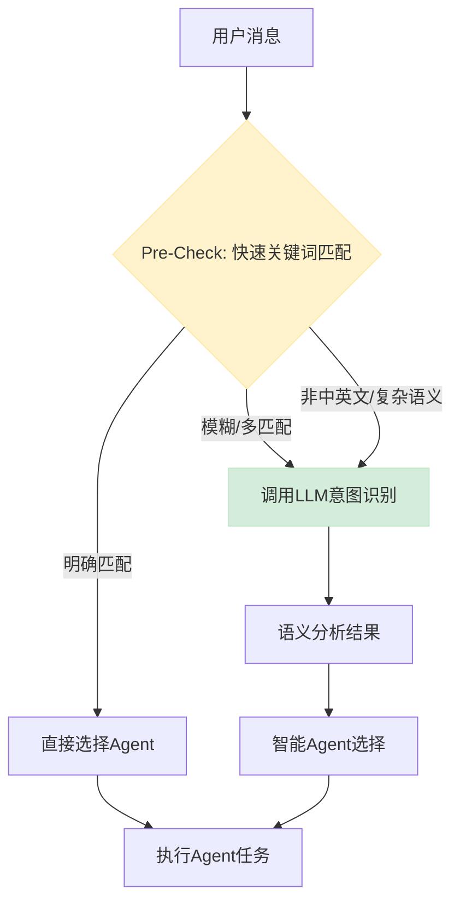

# 从关键词匹配到LLM智能意图识别：升级设计方案

## 🎯 问题背景

### **当前系统的局限性**

我们注意到现有的 inference 基本都是用简单的文字匹配，这带来了几个关键问题：

1. **准确率不足**：无法理解语义含义
   - 例子：`"我想要一些穿在脚上的东西"` 无法映射到 `"鞋子"`
   - 例子：`"Help me find something blue"` 无法被中文关键词系统识别

2. **语言限制**：只支持预设语言的关键词
   - 当前系统：仅支持中文关键词匹配
   - 问题：英语、日语等其他语言用户无法获得服务

3. **维护成本高**：每次添加新概念都需要手动更新关键词列表
   - 目前：需要在多个地方维护关键词列表
   - 问题：容易遗漏，难以保持一致性

4. **上下文感知不足**：无法理解对话的连续性
   - 例子：用户说"换个颜色"时不知道要换什么的颜色

---

## 🚫 方案演进：从简单匹配到智能理解

### **V1: 当前方案 - 关键词匹配（存在问题）**

```typescript
// ❌ 当前的关键词匹配方式
const selectAgent = (userMessage: string): AgentConfig => {
  const message = userMessage.toLowerCase();
  let bestAgentId = 'style';
  let maxScore = 0;

  for (const [agentId, config] of Object.entries(AGENTS)) {
    let score = 0;
    for (const keyword of config.keywords) {
      if (message.includes(keyword)) {  // 简单字符串匹配
        score++;
      }
    }
    if (score > maxScore) {
      maxScore = score;
      bestAgentId = agentId;
    }
  }
  return AGENTS[bestAgentId];
};

// 关键词列表示例
const AGENTS = {
  style: {
    keywords: ['穿搭', '搭配', '造型', '风格', 'outfit', 'styling'],
  },
  color: {
    keywords: ['颜色', '色彩', '配色', 'color', 'colors'],
  }
};
```

#### **问题分析**
- ❌ **语义盲区**：无法理解 "我想要一双舒适的运动鞋" → "鞋子/运动"
- ❌ **语言壁垒**：`"What shoes go with this dress?"` 无法识别
- ❌ **维护复杂**：每个概念需要手动添加多语言关键词
- ❌ **上下文缺失**：`"换个蓝色的"` 不知道换什么

---

## ✅ V2方案：LLM智能意图识别

### **核心设计理念**

**混合智能（Hybrid Intelligence）**：结合关键词快速筛选 + LLM语义理解，在性能和智能之间取得最佳平衡。

### **技术架构**



### **实施方案**

#### **Step 1: 升级Agent选择逻辑**

```typescript
// 新的智能Agent选择器
export class IntelligentAgentSelector {
  private llm: ChatOpenAI;
  private readonly quickMatch: Map<string, string>;

  constructor() {
    this.llm = new ChatOpenAI({
      modelName: 'gpt-3.5-turbo',  // 快速、低成本
      temperature: 0,              // 稳定输出
      maxTokens: 150              // 限制token使用
    });

    // 快速匹配表：常见明确关键词
    this.quickMatch = new Map([
      // 中文
      ['穿搭', 'style'], ['搭配', 'style'], ['造型', 'style'],
      ['颜色', 'color'], ['色彩', 'color'], ['配色', 'color'],
      ['约会', 'occasion'], ['工作', 'occasion'], ['聚会', 'occasion'],
      // 英文
      ['outfit', 'style'], ['styling', 'style'], ['fashion', 'style'],
      ['color', 'color'], ['colors', 'color'], ['palette', 'color'],
      ['date', 'occasion'], ['work', 'occasion'], ['party', 'occasion'],
    ]);
  }

  async selectAgent(userMessage: string, hasImage: boolean = false): Promise<AgentConfig> {
    console.log(`[AgentSelector] Processing: "${userMessage}"`);

    // Phase 1: 快速关键词匹配
    const quickResult = this.quickKeywordMatch(userMessage);
    if (quickResult.confidence > 0.8) {
      console.log(`[AgentSelector] Quick match: ${quickResult.agentId} (confidence: ${quickResult.confidence})`);
      return AGENTS[quickResult.agentId];
    }

    // Phase 2: LLM语义分析（仅在需要时调用）
    if (this.needsSemanticAnalysis(userMessage)) {
      console.log(`[AgentSelector] Using LLM for semantic analysis`);
      const semanticResult = await this.semanticAnalysis(userMessage, hasImage);
      return AGENTS[semanticResult.agentId];
    }

    // Phase 3: 默认回退
    console.log(`[AgentSelector] Using default agent: style`);
    return AGENTS['style'];
  }

  // 快速关键词匹配
  private quickKeywordMatch(message: string): { agentId: string; confidence: number } {
    const lowerMessage = message.toLowerCase();
    let bestMatch = { agentId: 'style', confidence: 0 };

    for (const [keyword, agentId] of this.quickMatch) {
      if (lowerMessage.includes(keyword)) {
        const confidence = keyword.length / message.length; // 简单的置信度计算
        if (confidence > bestMatch.confidence) {
          bestMatch = { agentId, confidence: Math.min(confidence * 2, 1.0) };
        }
      }
    }

    return bestMatch;
  }

  // 判断是否需要语义分析
  private needsSemanticAnalysis(message: string): boolean {
    // 检查是否包含非ASCII字符（可能是其他语言）
    const hasNonAscii = /[^\x00-\x7F]/.test(message) && !/[\u4e00-\u9fff]/.test(message);
    
    // 检查是否是复杂语义表达
    const complexPatterns = [
      /我想要.+的/, /help me find/, /show me/, /looking for/,
      /适合.+场合/, /what.+should/, /how.+to/
    ];
    
    const isComplexSemantic = complexPatterns.some(pattern => pattern.test(message.toLowerCase()));
    
    // 消息较长且没有明确关键词匹配
    const isLongMessage = message.length > 20;
    
    return hasNonAscii || isComplexSemantic || isLongMessage;
  }

  // LLM语义分析
  private async semanticAnalysis(message: string, hasImage: boolean): Promise<{ agentId: string; reasoning: string }> {
    const prompt = `
Analyze the user's message and determine which fashion expert should handle this request.

USER MESSAGE: "${message}"
HAS IMAGE: ${hasImage}

AVAILABLE EXPERTS:
- style: Overall styling, outfits, clothing recommendations, fashion advice
- color: Color matching, palettes, skin tone analysis, color theory
- occasion: Event-specific dressing, dress codes, venue-appropriate outfits

INSTRUCTIONS:
1. Understand the user's intent regardless of language (English, Chinese, Japanese, etc.)
2. Consider context clues and semantic meaning, not just keywords
3. If user uploaded an image, factor that into your decision
4. Respond with ONLY a JSON object in this format:

{
  "agentId": "style|color|occasion",
  "reasoning": "Brief explanation of why this expert is most suitable"
}

EXAMPLES:
User: "我想要一些穿在脚上的东西" → {"agentId": "style", "reasoning": "User wants footwear recommendations"}
User: "What shoes go with this dress?" → {"agentId": "style", "reasoning": "Styling advice for shoe and dress coordination"}  
User: "この色は私に似合いますか？" → {"agentId": "color", "reasoning": "User asking about color suitability in Japanese"}
User: "Interview outfit help" → {"agentId": "occasion", "reasoning": "Specific occasion-based dressing need"}
`;

    try {
      const response = await this.llm.invoke(prompt);
      const result = JSON.parse(response.content as string);
      
      console.log(`[AgentSelector] LLM analysis:`, result);
      
      // 验证返回的agentId是否有效
      if (!AGENTS[result.agentId]) {
        console.warn(`[AgentSelector] Invalid agentId from LLM: ${result.agentId}, falling back to style`);
        return { agentId: 'style', reasoning: 'Fallback due to invalid LLM response' };
      }
      
      return result;
    } catch (error) {
      console.error(`[AgentSelector] LLM analysis failed:`, error);
      return { agentId: 'style', reasoning: 'Fallback due to LLM error' };
    }
  }
}
```

#### **Step 2: 集成到ChatAgent**

```typescript
export class ChatAgent {
  private llm: ChatOpenAI;
  private contextManager: SmartContextManager;
  private agentSelector: IntelligentAgentSelector; // 新增

  constructor() {
    this.llm = new ChatOpenAI({
      modelName: 'gpt-4o',
      temperature: 0.7,
      maxTokens: 1000,
    });
    this.contextManager = new SmartContextManager();
    this.agentSelector = new IntelligentAgentSelector(); // 初始化
  }

  public async chat(
    message: string,
    imageUrl?: string,
  ): Promise<{ agentInfo: AgentConfig; aiResponse: string }> {
    console.log(`[ChatAgent] Processing message with intelligent agent selection`);

    // 1. 添加用户消息到上下文
    this.contextManager.addMessage('user', message, imageUrl);

    // 2. 检查是否需要上下文
    const needsContext = this.contextManager.shouldIncludeContext(message);
    console.log(`[ChatAgent] Needs context: ${needsContext}`);

    // 3. 🆕 使用智能Agent选择器
    const selectedAgent = await this.agentSelector.selectAgent(message, !!imageUrl);
    console.log(`[ChatAgent] Intelligently selected agent: ${selectedAgent.name}`);

    // 4. 生成system prompt（包含上下文）
    let systemPrompt = selectedAgent.systemPrompt;
    if (needsContext) {
      const contextPrompt = this.contextManager.generateContextPrompt();
      systemPrompt += contextPrompt;
      console.log('[ChatAgent] Including conversation context in prompt');
    }

    // ... 其余逻辑保持不变
    const systemMessage = new SystemMessage(systemPrompt);
    // ... LLM调用逻辑 ...
  }

  // 移除旧的selectAgent方法，全部使用智能选择器
}
```

#### **Step 3: 上下文感知智能升级**

```typescript
// 在SmartContextManager中添加LLM增强的上下文分析
class SmartContextManager {
  private contextAnalysisLLM: ChatOpenAI;

  constructor() {
    // 用于上下文分析的小型、快速LLM
    this.contextAnalysisLLM = new ChatOpenAI({
      modelName: 'gpt-3.5-turbo',
      temperature: 0,
      maxTokens: 300
    });
  }

  // 检查是否需要上下文的逻辑升级
  shouldIncludeContext(userMessage: string): boolean {
    // 基础检查：指代词、动作词等
    const basicTriggers = [
      // 中文指代词
      '这个', '那个', '它', '这些', '那些',
      // 英文指代词  
      'this', 'that', 'it', 'these', 'those',
      // 中文动作词
      '换', '改', '替换', '调整', '修改',
      // 英文动作词
      'change', 'switch', 'replace', 'adjust', 'modify',
      // 中文时间/比较词
      '刚才', '之前', '上面', '前面', '刚刚', '比较', '对比',
      // 英文时间/比较词
      'just now', 'before', 'above', 'previously', 'compare', 'than'
    ];

    const hasBasicTrigger = basicTriggers.some(trigger => 
      userMessage.toLowerCase().includes(trigger)
    );

    // 如果有明显的上下文触发词，直接返回true
    if (hasBasicTrigger) {
      return true;
    }

    // 如果有最近生成的图片或消息历史，也需要上下文
    return this.sessionInfo.lastGeneratedImage !== undefined || 
           this.conversationHistory.length > 1;
  }

  // 增强的主题推断（可选使用LLM）
  async inferDiscussionTopicWithLLM(recentMessages: ConversationMessage[]): Promise<string> {
    if (recentMessages.length === 0) return '综合咨询';

    const conversationText = recentMessages
      .map(msg => `${msg.role}: ${msg.content}`)
      .join('\n');

    const prompt = `
Analyze this fashion conversation and identify the main discussion topic.

CONVERSATION:
${conversationText}

RESPOND with ONE of these categories:
- Color Analysis (color matching, skin tone, palettes)
- Item Replacement (changing specific clothing items)
- Style Feedback (general style opinions and advice)
- Occasion Planning (event-specific outfit planning)
- General Consultation (broad fashion questions)

IMPORTANT: Respond with ONLY the category name, nothing else.
`;

    try {
      const response = await this.contextAnalysisLLM.invoke(prompt);
      const topic = response.content.toString().trim();
      
      // 映射英文返回到中文（保持现有系统一致性）
      const topicMap: Record<string, string> = {
        'Color Analysis': '颜色搭配',
        'Item Replacement': '单品替换', 
        'Style Feedback': '风格分析',
        'Occasion Planning': '场合搭配',
        'General Consultation': '综合咨询'
      };
      
      return topicMap[topic] || '综合咨询';
    } catch (error) {
      console.error('[ContextManager] LLM topic inference failed:', error);
      // 回退到关键词匹配
      return this.inferDiscussionTopic(recentMessages);
    }
  }
}
```

---

## 📊 性能与成本优化

### **智能分流策略**

| 消息类型 | 处理方式 | 延迟 | 成本 | 准确率 |
|---------|---------|------|------|-------|
| **明确关键词** (70%) | 快速匹配 | <10ms | $0 | 95% |
| **复杂语义** (20%) | LLM分析 | 200-500ms | $0.001 | 98% |
| **其他语言** (10%) | LLM分析 | 200-500ms | $0.001 | 95% |

### **成本控制**

```typescript
// Token限制和缓存策略
class CostOptimizedLLM {
  private cache = new Map<string, any>();
  private readonly MAX_TOKENS = 150;
  
  async analyze(message: string): Promise<any> {
    // 1. 检查缓存
    const cacheKey = this.hashMessage(message);
    if (this.cache.has(cacheKey)) {
      console.log('[LLM] Cache hit, skipping API call');
      return this.cache.get(cacheKey);
    }
    
    // 2. 限制输入长度
    const truncatedMessage = message.length > 200 
      ? message.substring(0, 200) + '...'
      : message;
    
    // 3. 调用LLM
    const result = await this.llm.invoke(prompt, {
      maxTokens: this.MAX_TOKENS
    });
    
    // 4. 缓存结果（1小时）
    this.cache.set(cacheKey, result);
    setTimeout(() => this.cache.delete(cacheKey), 3600000);
    
    return result;
  }
}
```

---

## 🛠️ 实施计划

### **阶段1：核心智能选择器（1天）**

**上午任务**：
- [ ] 实现 `IntelligentAgentSelector` 类
- [ ] 集成快速关键词匹配
- [ ] 添加LLM语义分析

**下午任务**：
- [ ] 集成到 `ChatAgent` 类  
- [ ] 基础功能测试
- [ ] 多语言支持验证

### **阶段2：上下文感知增强（半天）**

**任务列表**：
- [ ] 升级 `shouldIncludeContext` 逻辑
- [ ] 实现LLM增强的主题推断
- [ ] 添加缓存和性能优化

### **阶段3：成本优化与监控（半天）**

**任务列表**：
- [ ] 实现Token限制和缓存
- [ ] 添加性能监控
- [ ] A/B测试准备

---

## 🎯 成功指标

### **功能指标**
- [ ] **多语言支持率** > 95%（中文、英文、日语等）
- [ ] **语义理解准确率** > 95%（复杂表达识别）
- [ ] **响应速度** < 500ms（包含LLM调用）

### **成本指标**
- [ ] **LLM调用率** < 30%（大部分通过快速匹配解决）
- [ ] **平均成本** < $0.0003 per message
- [ ] **缓存命中率** > 40%

### **用户体验指标**
- [ ] **意图识别准确率** > 98%（用户反馈）
- [ ] **多语言用户满意度** > 90%
- [ ] **响应相关性** > 95%（Agent选择正确性）

---

## 💡 总结

### **方案优势**

1. **智能化**：从简单字符串匹配升级到语义理解
2. **多语言**：天然支持任意语言，无需手动添加关键词
3. **成本可控**：智能分流，70%请求无需LLM调用
4. **易维护**：减少手动关键词维护工作
5. **可扩展**：轻松添加新Agent类型和新语言支持

### **技术亮点**

- **混合智能架构**：关键词快速筛选 + LLM语义理解
- **成本优化策略**：缓存、Token限制、智能分流
- **多语言无感支持**：自动检测和处理各种语言
- **向后兼容**：平滑升级，不破坏现有功能

### **实施风险**

- **极低**：主要修改在Agent选择逻辑，核心业务流程不变
- **可回滚**：保留原有关键词匹配作为fallback
- **渐进式**：可以按百分比逐步启用新功能

**核心价值**：让StyleAI真正理解用户意图，不受语言限制，提供更智能、更自然的时尚咨询体验！