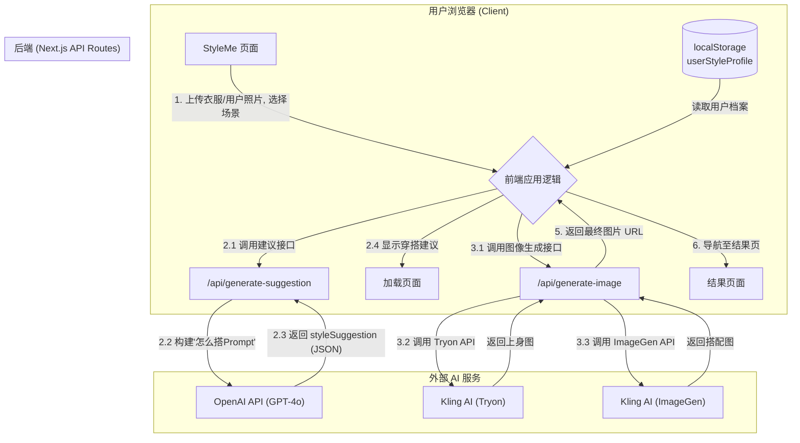

# 系统设计文档 - StyleAI

## 1. 概述

StyleAI 是一个个性化时尚造型辅助应用。它利用先进的 AI 技术分析用户的个人照片，以确定其独特的身体特征、脸型和风格气质，从而生成一份专业的个人风格档案。基于这份档案，应用可以为用户生成符合其个人特点并融合了全新目标风格的穿搭造型图片，实现高度个性化的虚拟试衣和风格探索体验。

## 2. 系统架构

本系统采用现代化的 Jamstack 架构，利用 Next.js 框架构建一体化的前端和后端（BFF - Backend for Frontend）。

-   **前端 (Frontend)**:
    -   **框架**: Next.js (React)
    -   **语言**: TypeScript
    -   **样式**: Tailwind CSS & shadcn/ui

-   **后端 (Backend)**:
    -   **环境**: Next.js API Routes (Serverless Functions)
    -   **职责**: 作为前端的代理和协调器，处理对外部 AI 服务的请求，封装业务逻辑，并隐藏敏感的 API 密钥。

-   **外部 AI 服务 (External Services)**:
    -   **风格分析**: OpenAI API (GPT-4o Vision)，用于从用户照片中提取结构化的风格特征。
    -   **图像生成**: Kling AI API (或类似模型)，用于根据详细的 Prompt 生成高质量的穿搭图片。

-   **数据存储 (Data Storage)**:
    -   **方案**: 浏览器 `localStorage`
    -   **用途**: 在当前的原型阶段，用于存储非敏感的用户会话数据，例如用户上传的照片、AI 分析结果以及生成的历史图片记录。这种方式简化了架构，无需数据库即可实现客户端持久化。

## 3. 核心用户流程与组件

### 3.1 用户引导与风格分析

这是用户首次与应用交互的核心流程，旨在为其建立个人风格档案。

1.  **数据收集**: 用户通过多步骤引导流程，上传一张全身照和一张头部照片，并输入个人风格偏好（如喜欢的风格、不喜欢的风格、常出现的场合等）。
2.  **AI 分析**: 在流程中，前端将照片发送到后端的 `/api/analyze-photos` 端点，获取由 AI 生成的客观风格分析结果。
3.  **整合与存储**: 在引导流程的最后一步，前端将 **AI 分析结果** 和 **用户的偏好输入** 整合为一个统一、完整的 `userStyleProfile` 对象。
4.  **持久化**: 这个 `userStyleProfile` 对象被完整地存储在浏览器的 `localStorage` 中，作为后续所有个性化功能的唯一数据来源。

### 3.2 "我的风格" 页面

这是展示用户个人风格档案的仪表盘。

1.  **数据加载**: 页面从 `localStorage` 中读取完整的 `userStyleProfile` 数据。
2.  **内容展示**: 以用户友好的方式，可视化地展示 `userStyleProfile` 中的所有内容，包括 AI 的客观分析（体型、脸型等）和用户的主观偏好（喜欢的风格等）。

### 3.3 个性化图像生成

这是应用的核心价值体现，将用户的个人特质与衣服融合。

1. **上传搭配目标照片**: 在"StyleMe"页面：
 - 1 衣服图片： 用户上传他们想要搭配的衣服
 - 2 自己的照片： optional选上传自己的新的照片， default是onboarding的时候上传的身体照片
- 3 场景： optional选择一个他们要去的场景（例如："咖啡店"、"约会"）

2. 穿搭建议
2.1 **调用穿搭建议生成接口**: 前端将这个 Prompt 和用户的参考照片 URLs 发送到后端的 `/api/generate-suggestion` 端点。
2.2 **构建"怎么搭Prompt"**: 后端根据我们设计的 `createStylingPrompt` 函数：从 `userStyleProfile` （包含AI分析和用户偏好）结合第一步上传的图片（ 1 衣服图片； 2 自己的照片；3 场景），动态地组合成一个"怎么搭Prompt"。
2.3  **穿搭建议生成**: 后端调用OpenAI，并将此"怎么搭Prompt"作为核心指令。
2.4 **展示loading页面**  "怎么搭Prompt"的结果`styleSuggestion`返回给前端，展示在loading screen。包括：
    1. scene_fit：如何根据该场景穿搭得体不突兀？是否需要调整风格或搭配方式？
    2. style_alignment：该衣物属于哪种风格？建议如何选配其它单品来保持风格一致或形成混搭美感？
    3. personal_match：考虑用户的体型、骨架、面部风格，如何扬长避短、突出优势？
    4. visual_focus：该单品视觉重点在哪？需要通过哪些搭配形成视觉平衡？
    5. material_silhouette：建议搭配哪些材质或剪裁的单品来提升质感或调整体型比例？
    6. color_combination：推荐使用哪些主色/辅助色？是否要加入点缀色？注意与肤色冷暖调匹配。
    7. reuse_versatility：该单品如何搭配出不同风格/场合的 look，提升使用率与可持续性？
3. 搭配图片生成
3.1 **调用图像生成接口**: `styleSuggestion`返回的同时，发送到后端的 `/api/generate-image` 端点。
3.2 **AI tryon生成** 后端调用Kling AI 的tryon接口，结合第一步上传的图片（ 1 衣服图片； 2 自己的照片）生成上身图
3.3 **构建"AI搭配图片生成Prompt"** AI tryon生成的同时，根据我们设计的 `createImagePrompt` 函数：从 `styleSuggestion`中间提取image_prompt，结合第一步上传的图片（ 1 衣服图片； 2 自己的照片；3 场景），动态地组合成一个"搭配图片生成Prompt"。
3.3 **AI搭配图片生成**: 后端调用 Kling AI 的图像生成接口，并AI tryon生成返回的图片作为主题图片，"搭配图片生成Prompt"作为核心指令。
5.  **返回结果**: 后端处理完（可能是异步轮询）图像生成任务后，将最终的图片 URL 返回给前端。
6. **展示结果页面**: 前端将用户导航到结果页面，展示这张为他们量身定制的新造型图片，并将其存入 `localStorage` 的历史记录中。

## 4. prompt

1."怎么搭Prompt":
 ``` 你是一位专业的穿搭顾问，请根据以下输入，生成一套关于"如何搭配这件衣服"的七维度建议，结构请严格遵循 schema 格式（JSON 格式），字段包括：
scene_fit, style_alignment, personal_match, visual_focus, material_silhouette, color_combination, reuse_versatility, image_prompt。

---

【用户风格档案】

- 体型：{{ aiAnalysis.bodyType }}
- 骨架结构：{{ aiAnalysis.boneStructure }}
- 面部风格：{{ aiAnalysis.face_style.type_name }}（关键词：{{ aiAnalysis.face_style.feature_keywords | join("、") }}）
- 风格印象总结：{{ aiAnalysis.styleInitialSense }}
- 身体优势部位：{{ aiAnalysis.bodyAdvantages | join("、") }}

【用户主观偏好】

- 偏好风格：{{ userPreferences.style.preferred | join("、") }}；自定义风格：{{ userPreferences.style.customPreferred }}
- 灵感来源：{{ userPreferences.style.inspirations | join("、") }}；自定义灵感：{{ userPreferences.style.customInspiration }}
- 避免元素：{{ userPreferences.boundaries.avoidedElements | join("、") }}；自定义避雷：{{ userPreferences.boundaries.customAvoided }}

【穿搭场景】

- {{ userPreferences.occasion.custom || userPreferences.occasion.primary || "日常通勤" }}

【待搭配的目标单品】

- 图片分析描述或内容提示：{{ uploadedClothingImageDescription }}

---

请输出以下七项内容，每项以一段文字清晰描述，不使用 markdown、无多余标签，仅输出符合 schema 的 JSON 对象：

1. scene_fit：如何根据该场景穿搭得体不突兀？是否需要调整风格或搭配方式？
2. style_alignment：该衣物属于哪种风格？建议如何选配其它单品来保持风格一致或形成混搭美感？
3. personal_match：考虑用户的体型、骨架、面部风格，如何扬长避短、突出优势？
4. visual_focus：该单品视觉重点在哪？需要通过哪些搭配形成视觉平衡？
5. material_silhouette：建议搭配哪些材质或剪裁的单品来提升质感或调整体型比例？
6. color_combination：推荐使用哪些主色/辅助色？是否要加入点缀色？注意与肤色冷暖调匹配。
7. reuse_versatility：该单品如何搭配出不同风格/场合的 look，提升使用率与可持续性？
8. image_prompt: 基于七维度的 summary，以完整描述的方式整合
```

## 5. 架构图

